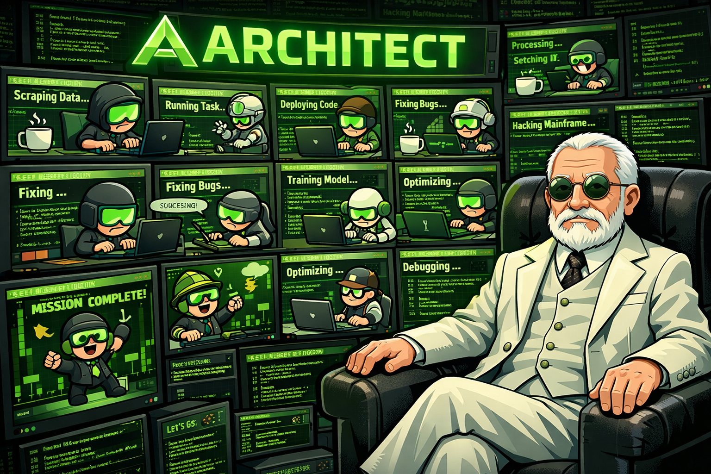

# Architect - Terminal Wall

[](https://github.com/forketyfork/architect/actions/workflows/build.yml)
[](LICENSE)
[](https://ziglang.org/)



A Zig terminal multiplexer that displays 9 interactive terminal sessions in a 3×3 grid with smooth expand/collapse animations. Built on ghostty-vt for terminal emulation and SDL3 for rendering.

> [!WARNING]
> **This project is in early stages of development. Use at your own risk.**
>
> The application is experimental and may have bugs, stability issues, or unexpected behavior. See [Known Limitations](#known-limitations) for current shortcomings.


## Installation

### Download Pre-built Binary (macOS)

Download the latest release from the [releases page](https://github.com/forketyfork/architect/releases).

**For Apple Silicon (M1/M2/M3/M4):**
```bash
curl -LO https://github.com/forketyfork/architect/releases/latest/download/architect-macos-arm64.tar.gz
tar -xzf architect-macos-arm64.tar.gz
xattr -dr com.apple.quarantine .
./architect
```

**For Intel Macs:**
```bash
curl -LO https://github.com/forketyfork/architect/releases/latest/download/architect-macos-x86_64.tar.gz
tar -xzf architect-macos-x86_64.tar.gz
xattr -dr com.apple.quarantine .
./architect
```

**Note**:
- The archive contains a small launcher `architect`, the main binary `architect.bin`, and a `lib/` directory with required dynamic libraries. Keep all of them in the same location.
- Not sure which architecture? Run `uname -m` - if it shows `arm64`, use the ARM64 version; if it shows `x86_64`, use the Intel version.

### Build from Source

See [Setup](#setup) section below for building from source.

## Features

- **3×3 Terminal Grid**: Run 9 independent shell sessions simultaneously
- **Smooth Animations**: Click any terminal to smoothly expand it to full screen
- **Full-Window Scaling**: Each terminal is sized for the full window and scaled down in grid view
- **Resizable Window**: Dynamically resize the window with automatic terminal and PTY resizing
- **Terminal Switching**: Use Cmd+Shift+[ / Cmd+Shift+] to switch between terminals in full-screen mode with smooth horizontal panning animation
- **Real-Time I/O**: Non-blocking PTY communication with live updates
- **Interactive Control**:
  - Click any grid cell to expand
  - Press ESC to collapse back to grid view
  - Type in the focused terminal
- **Scrollback in Place**: Hover any terminal and use the mouse wheel to scroll history; typing snaps back to live output and a yellow strip in grid view shows when you're scrolled
- **High-Quality Rendering**: SDL_ttf font rendering with glyph caching, vsynced presentation, and cached grid tiles to reduce redraw work
- **Persistent Configuration**: Automatically saves and restores font size, window dimensions, and window position
- **Font Size Adjustment**: Use Cmd+Plus/Minus to adjust font size (saved automatically)
- **Claude-friendly hooks**: Unix domain socket for notifying Architect when a session is waiting for approval or finished; grid tiles highlight with a fat yellow border

## Prerequisites

- Nix with flakes enabled

## Setup

1. Clone the ghostty dependency:
   ```bash
   just setup
   ```

   This will clone `ghostty-org/ghostty` into the `ghostty/` directory.

2. Update the Nix flake and enter the development shell:
   ```bash
   nix flake update
   nix develop
   ```

   Alternatively, if using direnv:
   ```bash
   direnv allow
   ```

3. Verify the environment:
   ```bash
   zig version  # Should show 0.15.2+ (compatible with ghostty-vt)
   just --list  # Show available commands
   ```

## Building

Build the project:
```bash
just build
# or
zig build
```

Build optimized release:
```bash
zig build -Doptimize=ReleaseFast
```

Run the application:
```bash
just run
# or
zig build run
```

## Configuration

Architect automatically saves your preferences to `~/.config/architect/config.json`. The configuration includes:

- **Font size**: Adjusted via Cmd+Plus/Minus shortcuts (range: 8-32px, default: 14px)
- **Window dimensions**: Automatically saved when you resize the window
- **Window position**: Saved along with window dimensions when you resize or adjust font size

The configuration file is created automatically on first use and updated whenever settings change. No manual editing required.

**Example configuration:**
```json
{
  "font_size": 16,
  "window_width": 1920,
  "window_height": 1080,
  "window_x": 150,
  "window_y": 100
}
```

To reset to defaults, simply delete the configuration file:
```bash
rm ~/.config/architect/config.json
```

## Development

Run tests:
```bash
just test
# or
zig build test
```

Check code formatting:
```bash
just lint
# or
zig fmt --check src/
```

Format code:
```bash
zig fmt src/
```

### UI/Rendering helpers

- Geometry + hit testing helpers live in `src/geom.zig`.
- Shared easing functions live in `src/anim/easing.zig`.
- Rounded/thick border drawing helpers live in `src/gfx/primitives.zig`; use these instead of redefining SDL primitives in new UI components.
- The UI framework entrypoint is `src/ui/`: `UiRoot` handles event dispatch, per-frame updates, and overlay rendering for registered UI components.
- Architecture and layering overview: see `docs/architecture.md`.

## Claude Code Integration

- **Notification socket**: Architect listens on `${XDG_RUNTIME_DIR:-/tmp}/architect_notify_<pid>.sock` (Unix domain socket, mode 0600, where `<pid>` is the process ID).
- **Per-shell env**: Each spawned shell receives `ARCHITECT_SESSION_ID` (0‑based grid index) and `ARCHITECT_NOTIFY_SOCK` (socket path) so tools inside the terminal can send status.
- **Protocol**: Send a single-line JSON object to the socket:
  - `{"session":0,"state":"start"}` clears the highlight and marks the session as running.
  - `{"session":0,"state":"awaiting_approval"}` turns on a pulsing yellow border in the 3×3 grid.
  - `{"session":0,"state":"done"}` shows a solid yellow border in the grid.
- **Example from inside a terminal session**:
  ```bash
  python - <<'PY'
  import json, socket, os
  sock = os.environ["ARCHITECT_NOTIFY_SOCK"]
  msg = json.dumps({"session": int(os.environ["ARCHITECT_SESSION_ID"]), "state": "awaiting_approval"}) + "\n"
  s = socket.socket(socket.AF_UNIX, socket.SOCK_STREAM)
  s.connect(sock)
  s.sendall(msg.encode())
  s.close()
  PY
  ```
- **Example from outside (host)**:
  ```bash
  # Find the socket (PID is included in the filename)
  SOCK=$(ls ${XDG_RUNTIME_DIR:-/tmp}/architect_notify_*.sock 2>/dev/null | head -1)

  # Send notification for session 0
  python - <<PY
  import json, socket, os
  sock = os.environ["SOCK"]
  s = socket.socket(socket.AF_UNIX, socket.SOCK_STREAM)
  s.connect(sock)
  s.sendall(json.dumps({"session":0,"state":"done"}).encode() + b"\n")
  s.close()
  PY
  ```

### Configuring Claude Code Hooks

To automatically send notifications when Claude Code stops or requests approval:

1. Download the notification script (included in this repository):
   ```bash
   cp architect_notify.py ~/.claude/architect_notify.py
   chmod +x ~/.claude/architect_notify.py
   ```

2. Add hooks to your `~/.claude/settings.json`:
   ```json
   {
     "hooks": {
       "Stop": [
         {
           "hooks": [
             {
               "type": "command",
               "command": "python3 ~/.claude/architect_notify.py done || true"
             }
           ]
         }
       ],
       "Notification": [
         {
           "hooks": [
             {
               "type": "command",
               "command": "python3 ~/.claude/architect_notify.py awaiting_approval || true"
             }
           ]
         }
       ]
     }
   }
   ```

3. Run Architect and start Claude Code in one of the terminal sessions. The grid cell will automatically highlight when Claude requests approval or completes a task.

## Releases

macOS release binaries are automatically built for both ARM64 (Apple Silicon) and x86_64 (Intel) architectures via GitHub Actions when a version tag is pushed:

```bash
git tag v0.1.0
git push origin v0.1.0
```

Each release includes:
- `architect-macos-arm64.tar.gz` - For Apple Silicon Macs (M1/M2/M3/M4)
- `architect-macos-x86_64.tar.gz` - For Intel Macs

Download the latest release from the [releases page](https://github.com/forketyfork/architect/releases).

## Project Structure

- `src/main.zig` - Main application with SDL3 event loop and animation system
- `src/shell.zig` - Shell process spawning and management
- `src/pty.zig` - PTY abstractions and utilities
- `src/font.zig` - Font rendering with SDL_ttf and glyph caching
- `src/config.zig` - Configuration persistence (saves font size, window size, and position)
- `src/c.zig` - C library bindings for SDL3
- `build.zig` - Zig build configuration with SDL3 dependencies
- `build.zig.zon` - Zig package dependencies
- `docs/` - Documentation and implementation plans
- `justfile` - Convenient command shortcuts
- `flake.nix` - Nix development environment
- `.github/workflows/` - CI/CD workflows (build and release)

## Dependencies

- **ghostty-vt**: Terminal emulation library from `ghostty-org/ghostty` (path dependency)
  - Provides terminal state machine and ANSI escape sequence parsing
  - Cloned locally into `ghostty/` directory (gitignored)
  - Configured in `build.zig.zon` to point to the local ghostty clone
- **SDL3**: Window management and rendering backend (via Nix)
- **SDL3_ttf**: Font rendering library (via Nix)

## Architecture

### Terminal Scaling
Each terminal session is initialized with full-window dimensions (calculated from font metrics). In grid view, these full-sized terminals are scaled down to 1/3 and rendered into grid cells, providing a "zoomed out" view of complete terminal sessions.

### Animation System
The application uses cubic ease-in-out interpolation to smoothly transition between grid and full-screen views over 300ms. Six view modes (Grid, Expanding, Full, Collapsing, PanningLeft, PanningRight) manage the animation state, including horizontal panning for terminal switching.

### Rendering Pipeline
1. Font glyphs are rendered to cached SDL textures
2. Terminal cells are iterated and glyphs drawn at scaled positions
3. Content is clipped to grid cell boundaries
4. Borders indicate focus state

## Implementation Status

✅ **Fully Implemented**:
- 3×3 grid layout with 9 terminal sessions
- PTY management and shell spawning
- Real-time terminal I/O
- SDL3 window and event loop with resizable window support
- Font rendering with SDL_ttf
- Click-to-expand interaction
- Smooth expand/collapse animations
- Terminal switching with horizontal panning animation (Cmd+Shift+[ / Cmd+Shift+])
- Keyboard input handling
- Full-window terminal scaling
- Dynamic terminal and PTY resizing on window resize
- Persistent configuration (font size, window size, and position)
- Font size adjustment via keyboard shortcuts (Cmd+Plus/Minus)
- Claude Code integration via Unix domain sockets
- Scrolling back through terminal history (mouse wheel) with a grid indicator when a pane is scrolled

## Known Limitations

The following features are not yet implemented:
- **No emoji support**: Unicode emojis may not render correctly
- **No font selection**: Hardcoded to SF Mono font (though size is adjustable)
- **Limited configurability**: Grid size, colors, and keybindings are hardcoded
- **Limited AI tool compatibility**: Works with Claude and Gemini models, but not with Codex

## License

MIT
