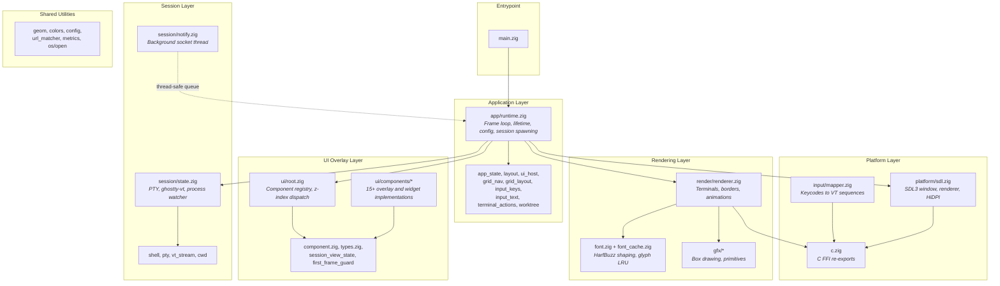

# Architecture

## System Overview

Architect is a **single-process, layered desktop application** built in Zig that functions as a grid-based terminal multiplexer optimized for multi-agent AI coding workflows. It follows a five-layer architecture: a thin entrypoint delegates to an application runtime that owns the frame loop, platform abstraction (SDL3), session management (PTY + ghostty-vt terminal emulation), scene rendering, and a component-based UI overlay system. All layers run on a single thread (except the notification socket listener), communicating through a synchronous frame loop that polls events, updates state, renders the scene, then renders UI overlays on top. The application uses an action-queue pattern for UI-to-app mutations, epoch-based cache invalidation for efficient rendering, and a vtable-based component registry for extensible UI overlays.

## Component Diagram



## Dependency Rules

Dependencies flow strictly downward through the layer stack. No upward or lateral dependencies between peer layers except through the Application layer.

```
Entrypoint
    |
    v
Application Layer  (app/runtime.zig orchestrates everything below)
    |
    +-----------+-----------+-----------+
    |           |           |           |
    v           v           v           v
Platform    Session    Rendering    UI Overlay
    |                     |           |
    v                     v           v
              Shared Utilities
```

**Invariants:**
- Session, Rendering, and UI Overlay layers never import from each other directly. All cross-layer communication flows through the Application layer or shared types.
- UI components communicate with the application exclusively via the `UiAction` queue (never direct state mutation).
- The only background thread is the notification socket listener (`session/notify.zig`); it communicates with the main thread via a thread-safe queue drained once per frame.
- Shared Utilities (`geom`, `colors`, `config`, `metrics`, etc.) may be imported by any layer but never import from layers above them.
- **Exception:** `app/*` modules may import `c.zig` directly for SDL type definitions used in input handling. This is a pragmatic shortcut for FFI constants, not a general license to depend on the Platform layer.

## Rules for New Code

These patterns are mandatory for all new code. They are derived from the architectural decisions (see ADRs below) and exist to prevent the most common structural violations.

1. **UI components use the vtable interface and communicate via UiAction queue.** Never mutate application state directly from a UI component. Push a `UiAction` to the queue; the main loop drains it after all component updates complete. (See ADR-003.)

2. **Render invalidation uses epoch comparison.** When terminal content changes, increment `render_epoch` on the `SessionState`. The renderer checks `presented_epoch < render_epoch` and only re-renders on mismatch. Never force a full re-render. (See ADR-004.)

3. **Blocking I/O goes on a background thread with a thread-safe queue.** The frame loop must never block. Any new external I/O source must follow the notification socket pattern: background thread + queue + main-loop drain. (See ADR-009.)

4. **Config vs. persistence separation.** User-editable preferences go in `config.toml`. Auto-managed runtime state (window position, recent folders, terminal cwds) goes in `persistence.toml`. Never mix them. (See ADR-010.)

5. **Use FirstFrameGuard for visibility transitions.** When a UI component moves to a visible state (modal opens, toast appears), call `markTransition()` and return `guard.wantsFrame()` from the component's `wantsFrame` method to bypass idle throttling. (See ADR-012.)

## Where to Put New Code

| I need to...                        | Put it in...                              |
|-------------------------------------|-------------------------------------------|
| Add a new UI element (overlay, dialog, widget) | `ui/components/`, implement `UiComponent` vtable, register in `UiRoot` |
| Add a new keyboard shortcut         | `ui/components/global_shortcuts.zig`      |
| Add terminal behavior or PTY logic  | `session/`                                |
| Add a rendering primitive           | `gfx/`                                    |
| Add a new config option             | `config.zig` + `config.toml` docs         |
| Add a new persisted runtime value   | `config.zig` (persistence section) + `persistence.toml` docs |
| Add cross-layer shared types        | Shared Utilities (`geom.zig`, `colors.zig`, etc.) |
| Add a new UiAction                  | `ui/types.zig` (tagged union) + handler in `app/runtime.zig` |
| Add external tool integration       | `session/notify.zig` (extend notification protocol) |

## Data Flow

### Frame Loop (per frame, ~16ms active / ~50ms idle)

```
                    +--------------------------------------+
                    |          SDL Event Queue              |
                    +------------------+-------------------+
                                       | poll
                                       v
                    +--------------------------------------+
                    |   Scale to render coordinates         |
                    +------------------+-------------------+
                                       |
                                       v
                    +--------------------------------------+
                    |   Build UiHost snapshot               |
                    |   (window size, grid, theme, etc.)    |
                    +------------------+-------------------+
                                       |
                                       v
                    +--------------------------------------+
                    |   ui.handleEvent()                    |
                    |   (topmost z-index first)             |
                    |   consumed? --- yes --> skip app logic|
                    +------------------+-------------------+
                                       | no
                                       v
                    +--------------------------------------+
                    |   App event switch                    |
                    |   (shortcuts, terminal input, resize) |
                    +------------------+-------------------+
                                       |
                                       v
                    +--------------------------------------+
                    |   xev loop iteration                  |
                    |   (async process exit detection)      |
                    +------------------+-------------------+
                                       |
                                       v
                    +--------------------------------------+
                    |   Drain session output -> ghostty-vt  |
                    |   Drain notification queue             |
                    +------------------+-------------------+
                                       |
                                       v
                    +--------------------------------------+
                    |   ui.update() + drain UiAction queue  |
                    |   (UI->app mutations applied here)    |
                    +------------------+-------------------+
                                       |
                                       v
                    +--------------------------------------+
                    |   Advance animation state             |
                    +------------------+-------------------+
                                       |
                                       v
                    +--------------------------------------+
                    |   renderer.render() -> scene          |
                    |   ui.render()       -> overlays       |
                    |   SDL_RenderPresent()                 |
                    +--------------------------------------+
```

### Terminal Output Path

```
Shell process
    | writes to PTY
    v
session.output_buf (kernel buffer -> userspace read)
    | processBytes()
    v
vt_stream.zig -> ghostty-vt parser
    | state machine updates
    v
Terminal cell buffer (content, attributes, colors)
    | session.render_epoch += 1
    v
Renderer cache dirty check (presented_epoch < render_epoch?)
    | yes -> re-render
    v
font.zig -> HarfBuzz shaping -> glyph textures
    |
    v
SDL_RenderTexture() -> frame presented
```

### Terminal Input Path

```
Physical keyboard
    |
    v
SDL_EVENT_KEY_DOWN / SDL_EVENT_TEXT_INPUT
    | scaled to render coordinates
    v
UiRoot.handleEvent() (components by z-index)
    | not consumed
    v
App event switch -> shortcut detection
    | not a shortcut
    v
input/mapper.zig -> encodeKey() -> VT escape sequence bytes
    |
    v
session.pending_write buffer
    | next frame
    v
PTY write() -> shell process stdin
```

### External Notification Path

```
External tool (Claude Code, Codex, Gemini)
    | JSON over Unix socket
    v
session/notify.zig (background thread)
    | parse {"session": N, "state": "awaiting_approval"}
    | or    {"session": N, "type": "story", "path": "/abs/path"}
    v
NotificationQueue (thread-safe)
    | main loop drains each frame
    v
Status notifications -> SessionStatus updated (idle -> awaiting_approval)
Story notifications  -> StoryOverlay opens with file content
    |
    v
Renderer draws attention border / story overlay
```

### Entry Points

| Entry Point | Source | Description |
|------------|--------|-------------|
| SDL event queue | Keyboard, mouse, window events | Primary user interaction |
| PTY read | Shell process stdout/stderr | Terminal content updates |
| Unix domain socket | External AI tools | Status notifications (JSON) |
| Config files | `~/.config/architect/` | Startup configuration and persistence |

### Storage

| Store | Location | Contents |
|-------|----------|----------|
| Terminal cell buffer | In-memory (ghostty-vt) | Current screen + scrollback (up to 10KB default) |
| Glyph cache | GPU textures + in-memory LRU | Up to 4096 shaped glyph textures |
| Render cache | GPU textures per session | Cached terminal renders, epoch-invalidated |
| config.toml | `~/.config/architect/config.toml` | User preferences (font, theme, UI flags) |
| persistence.toml | `~/.config/architect/persistence.toml` | Runtime state (window pos, font size, terminal cwds) |
| diff_comments.json | `<repo>/.architect/diff_comments.json` | Per-repo inline diff review comments (unsent) |

### Exit Points

| Exit Point | Destination | Description |
|------------|-------------|-------------|
| PTY write | Shell process stdin | Encoded keyboard input |
| SDL renderer | Display | Rendered frames via GPU |
| Config write | Filesystem | Persisted window state and terminal cwds on quit |
| URL open | OS browser | Cmd+Click hyperlinks via `os/open.zig` |

## Module Boundary Table

| Module | Responsibility | Public API (key functions/types) | Dependencies |
|--------|---------------|----------------------------------|--------------|
| `main.zig` | Thin entrypoint | `main()` | `app/runtime` |
| `app/runtime.zig` | Application lifetime, frame loop, session spawning, config persistence | `run()`, frame loop internals | `platform/sdl`, `session/state`, `render/renderer`, `ui/root`, `config`, all `app/*` modules |
| `app/*` (app_state, layout, ui_host, grid_nav, grid_layout, input_keys, input_text, terminal_actions, worktree) | Application logic decomposed by concern: state enums, grid sizing, UI snapshot building, navigation, input encoding, clipboard, worktree commands | `ViewMode`, `AnimationState`, `SessionStatus`, `buildUiHost()`, `applyTerminalResize()`, `encodeKey()`, `paste()`, `clear()` | `geom`, `anim/easing`, `ui/types`, `ui/session_view_state`, `colors`, `input/mapper`, `session/state`, `c` |
| `platform/sdl.zig` | SDL3 initialization, window management, HiDPI | `init()`, `createWindow()`, `createRenderer()` | `c` |
| `input/mapper.zig` | SDL keycodes to VT escape sequences, shortcut detection | `encodeKey()`, modifier helpers | `c` |
| `c.zig` | C FFI re-exports (SDL3, SDL3_ttf constants) | `SDLK_*`, `SDL_*`, `TTF_*` re-exports | SDL3 system libs (via `@cImport`) |
| `session/state.zig` | Terminal session lifecycle: PTY, ghostty-vt, process watcher | `SessionState`, `init()`, `deinit()`, `ensureSpawnedWithDir()`, `render_epoch`, `pending_write` | `shell`, `pty`, `vt_stream`, `cwd`, `font`, xev |
| `session/notify.zig` | Background notification socket thread and queue; handles status and story notifications | `NotificationQueue`, `Notification` (union: status/story), `startThread()`, `push()`, `drain()` | std (socket, thread) |
| `session/*` (shell, pty, vt_stream, cwd) | Shell spawning, PTY abstraction, VT parsing, working directory detection | `spawn()`, `Pty`, `VtStream.processBytes()`, `getCwd()` | std (posix), ghostty-vt |
| `render/renderer.zig` | Scene rendering: terminals, borders, animations | `render()`, `RenderCache`, per-session texture management | `font`, `font_cache`, `gfx/*`, `anim/easing`, `app/app_state`, `c` |
| `font.zig` + `font_cache.zig` | Font rendering, HarfBuzz shaping, glyph LRU cache, shared font cache | `Font`, `openFont()`, `renderGlyph()`, `FontCache`, `getOrCreate()` | `font_paths`, `c` (SDL3_ttf) |
| `gfx/*` (box_drawing, primitives) | Procedural box-drawing characters (U+2500-U+257F), rounded/thick border helpers | `renderBoxDrawing()`, `drawRoundedRect()`, `drawThickBorder()` | `c` |
| `ui/root.zig` | UI component registry, z-index dispatch, action drain | `UiRoot`, `register()`, `handleEvent()`, `update()`, `render()`, `needsFrame()` | `ui/component`, `ui/types` |
| `ui/component.zig` | UI component vtable interface | `UiComponent`, `VTable` (handleEvent, update, render, hitTest, wantsFrame, deinit) | `ui/types`, `c` |
| `ui/types.zig` | Shared UI type definitions | `UiHost`, `UiAction`, `UiActionQueue`, `UiAssets`, `SessionUiInfo` | `app/app_state`, `colors`, `font`, `geom` |
| `ui/session_view_state.zig` | Per-session UI interaction state (selection, scroll, hover, agent status) | `SessionViewState` (selection, scroll offset, hover, status) | `app/app_state` (for `SessionStatus` enum) |
| `ui/first_frame_guard.zig` | Idle throttle bypass for visible state transitions | `FirstFrameGuard`, `markTransition()`, `markDrawn()`, `wantsFrame()` | (none) |
| `ui/components/*` | Individual overlay and widget implementations conforming to `UiComponent` vtable. Includes: help overlay, worktree picker, recent folders picker, diff viewer (with inline review comments), story viewer (PR story file visualization), session interaction, toast, quit confirm, restart buttons, escape hold indicator, metrics overlay, global shortcuts, pill group, cwd bar, expanding overlay helper, button, confirm dialog, marquee label, hotkey indicator, flowing line, hold gesture detector. | Each component implements the `VTable` interface; overlays toggle via keyboard shortcuts or external commands and emit `UiAction` values. | `ui/component`, `ui/types`, `anim/easing`, `font`, `metrics`, `url_matcher`, `ui/session_view_state` |
| Shared Utilities (`geom`, `colors`, `config`, `metrics`, `url_matcher`, `os/open`, `anim/easing`) | Geometry primitives, theme/palette management, TOML config loading/persistence, performance metrics, URL detection, cross-platform URL opening, easing functions | `Rect`, `Theme`, `Config`, `Metrics`, `matchUrl()`, `open()`, `easeInOutCubic()`, `easeOutCubic()` | std, zig-toml, `c` |

## Key Architectural Decisions

### ADR-001: Five-Layer Single-Thread Architecture

- **Decision:** Organize the application into five layers (entrypoint, platform, session, rendering, UI overlay) running on a single main thread with only the notification socket on a background thread.
- **Context:** A terminal multiplexer needs tight control over frame timing, event ordering, and GPU resource management. Multi-threaded rendering introduces synchronization complexity without clear benefit for a UI-bound application. The notification socket is the only I/O that must not block the frame loop.
- **Alternatives considered:**
  - *Multi-threaded rendering* -- rejected because SDL3 renderers are not thread-safe, and the complexity of synchronizing terminal state across threads outweighs the marginal throughput gain.
  - *Async I/O everywhere* -- rejected because the frame loop is inherently synchronous (poll, update, render, present), and async patterns add indirection without improving latency for a 60 FPS UI.
- **Date:** 2025 (initial architecture)

### ADR-002: Component-Based UI Overlay System with VTable Dispatch

- **Decision:** UI overlays are implemented as components registered with a central `UiRoot` registry, each conforming to a `VTable` interface (handleEvent, update, render, hitTest, wantsFrame, deinit). Components are dispatched by z-index, highest first.
- **Context:** The application has 15+ distinct UI elements (help overlay, worktree picker, diff viewer, toast, quit dialog, etc.) that need independent lifecycle management, event handling priority, and rendering order. A centralized registry prevents ad-hoc event handling scattered across the main loop.
- **Alternatives considered:**
  - *Immediate-mode GUI* -- rejected because retain-mode components with cached textures reduce per-frame CPU work, and the vtable pattern is idiomatic in Zig for polymorphic dispatch.
  - *Ad-hoc event handling in main.zig* -- rejected because it leads to unmaintainable event switch growth as UI features are added; the component pattern isolates concerns.
- **Date:** 2025 (initial architecture)

### ADR-003: UiAction Queue for UI-to-App Mutations

- **Decision:** UI components never mutate application state directly. Instead, they push `UiAction` values (a tagged union) to a queue that the main loop drains after all component updates complete.
- **Context:** Direct mutation from UI components would create ordering dependencies between components and the main loop. A queue decouples intent from execution, making it safe to add/remove/reorder components without breaking state transitions.
- **Alternatives considered:**
  - *Direct callback functions* -- rejected because callbacks create implicit coupling and make it hard to reason about mutation ordering.
  - *Event bus / pub-sub* -- rejected as over-engineered for a single-process application; a simple queue with a typed union is sufficient and type-safe.
- **Date:** 2025 (initial architecture)

### ADR-004: Epoch-Based Render Cache Invalidation

- **Decision:** Each `SessionState` maintains a monotonic `render_epoch` counter that increments on terminal content changes. The renderer's `RenderCache` tracks the last presented epoch per session and only re-renders when epochs diverge.
- **Context:** Re-rendering all terminal cells every frame is expensive (glyph shaping, texture creation). Most frames in a multi-terminal grid have no changes in most sessions. Epoch comparison is O(1) per session and avoids deep content diffing.
- **Alternatives considered:**
  - *Dirty-flag per cell* -- rejected because tracking individual cell changes is memory-intensive and the granularity is unnecessary when the renderer caches entire session textures.
  - *Timer-based refresh* -- rejected because it wastes GPU cycles re-rendering unchanged terminals and introduces visible latency for changed ones.
- **Date:** 2025 (initial architecture)

### ADR-005: ghostty-vt for Terminal Emulation

- **Decision:** Use ghostty-vt (from the Ghostty terminal project) as the VT state machine and ANSI parser rather than implementing one from scratch.
- **Context:** Terminal emulation is a complex domain with thousands of edge cases (escape sequences, Unicode handling, alternate screen buffers, scrollback, etc.). ghostty-vt is a mature, well-tested implementation written in Zig, making it a natural fit for a Zig application.
- **Alternatives considered:**
  - *Custom VT parser* -- rejected because building a correct VT100/xterm-compatible parser is a multi-year effort and a maintenance burden orthogonal to the product goal.
  - *libvterm (C library)* -- rejected because it requires C FFI overhead and memory management coordination; ghostty-vt integrates natively with Zig's type system and allocator model.
- **Date:** 2025 (initial dependency choice)

### ADR-006: SDL3 for Rendering and Input

- **Decision:** Use SDL3 as the platform abstraction layer for window management, GPU-accelerated 2D rendering, input events, and font rendering (via SDL3_ttf with HarfBuzz).
- **Context:** The application needs cross-platform window management, hardware-accelerated texture rendering, and HiDPI support. SDL3 provides all of these with a C API that Zig can import directly via `@cImport`.
- **Alternatives considered:**
  - *Native platform APIs (AppKit/Metal)* -- rejected because it locks the project to macOS; SDL3 allows future Linux/Windows porting.
  - *Vulkan/OpenGL directly* -- rejected because 2D terminal rendering does not need low-level GPU control, and SDL3's renderer API is sufficient and simpler.
  - *Electron / web-based* -- rejected for performance and resource usage; a native Zig application has sub-millisecond event latency and minimal memory overhead.
- **Date:** 2025 (initial dependency choice)

### ADR-007: Lazy Session Spawning

- **Decision:** Only session 0 spawns a shell process on startup. Additional sessions spawn on first user interaction (click or keyboard navigation).
- **Context:** Users may configure a grid with many slots but only actively use a few. Eagerly spawning all shells wastes system resources (PTY file descriptors, process table entries, memory for terminal buffers) and slows startup.
- **Alternatives considered:**
  - *Eager spawn all* -- rejected because startup time scales linearly with session count, and unused PTYs waste kernel resources.
  - *Spawn on first output* -- rejected because sessions need a shell to produce output; spawn-on-interaction is the natural trigger.
- **Date:** 2025 (initial design)

### ADR-008: Procedural Box-Drawing Characters

- **Decision:** Box-drawing characters (U+2500-U+257F) are rendered procedurally via line/rectangle primitives rather than using font glyphs.
- **Context:** Font-based box-drawing characters often have alignment issues: gaps between cells, inconsistent line widths, or mismatched metrics across font families. Procedural rendering guarantees pixel-perfect alignment regardless of the chosen font.
- **Alternatives considered:**
  - *Font glyph rendering* -- rejected because alignment varies by font and size; even monospace fonts often have subpixel gaps in box-drawing characters.
  - *Pre-rendered sprite atlas* -- rejected because it doesn't scale with DPI or font size changes.
- **Date:** 2025 (rendering implementation)

### ADR-009: Thread-Safe Notification Queue for External Tool Integration

- **Decision:** External AI tools communicate with Architect via a Unix domain socket. A dedicated background thread accepts connections, parses single-line JSON messages, and pushes to a thread-safe queue. The main loop drains this queue once per frame.
- **Context:** AI coding agents (Claude Code, Codex, Gemini) need to signal state changes (start, awaiting_approval, done) to trigger visual indicators. Socket I/O must not block the render thread, but state updates must be applied synchronously during the frame loop to avoid race conditions with rendering.
- **Alternatives considered:**
  - *Polling a file or pipe* -- rejected because it introduces latency and filesystem overhead; sockets provide immediate delivery.
  - *D-Bus or platform IPC* -- rejected because it adds platform-specific dependencies; Unix domain sockets are simple and portable across macOS and Linux.
  - *Direct main-thread socket polling* -- rejected because accept/read can block; a background thread with a lock-free queue provides non-blocking integration.
- **Date:** 2025 (notification system implementation)

### ADR-010: TOML-Based Dual Configuration (User Prefs + Runtime State)

- **Decision:** Configuration is split into two TOML files: `config.toml` for user-editable preferences (font, theme, UI flags) and `persistence.toml` for auto-managed runtime state (window position, font size, terminal cwds, recent folders).
- **Context:** Mixing user preferences with volatile runtime state in a single file leads to merge conflicts and confusion when users manually edit configuration. Separating them allows `config.toml` to be version-controlled or shared, while `persistence.toml` is machine-specific and auto-managed.
- **Alternatives considered:**
  - *Single config file* -- rejected because auto-saving window position into a user-edited file causes unexpected diffs.
  - *JSON or YAML* -- rejected because TOML is designed for configuration files, has clear section semantics, and the zig-toml library provides native Zig integration without C FFI.
  - *SQLite for persistence* -- rejected as over-engineered for a handful of key-value pairs; TOML is human-readable and easy to debug.
- **Date:** 2025 (configuration system implementation)

### ADR-011: Hardcoded Keybindings

- **Decision:** All keyboard shortcuts are hardcoded in the source code. There is no user-configurable keybinding system.
- **Context:** The application has a small, focused set of shortcuts (Cmd+N, Cmd+W, Cmd+T, Cmd+D, Cmd+/, Cmd+1-0, Cmd+Return, Cmd+Q). A configurable keybinding system adds significant complexity (parser, conflict detection, documentation generation) for marginal user benefit at this stage.
- **Alternatives considered:**
  - *Config-driven keybindings* -- deferred, not rejected; may be added as the shortcut set grows, but current simplicity is preferred during early development.
- **Date:** 2025 (input system implementation)

### ADR-012: FirstFrameGuard Pattern for Idle Throttle Bypass

- **Decision:** When a UI component transitions to a visible state (modal opens, gesture starts), it uses a `FirstFrameGuard` to signal the frame loop that an immediate render is needed, bypassing idle throttling.
- **Context:** The frame loop throttles to ~20 FPS when idle (no terminal output or user input). Without the guard, newly visible UI elements would appear with up to 250ms delay, creating a perceived lag. The guard ensures the first frame of a transition renders immediately.
- **Alternatives considered:**
  - *Always render at full rate* -- rejected because it wastes CPU/GPU when nothing is changing, impacting battery life on laptops.
  - *SDL event injection* -- rejected because synthetic events pollute the event queue and complicate event handling logic.
- **Date:** 2025 (UI system refinement)

### ADR-013: Synchronous I/O in UI Overlays for Git and Small-File Persistence

- **Decision:** UI overlay components may perform synchronous I/O on the main thread for two categories of operations: (1) running short-lived `git` commands (e.g., `git diff`, `git rev-parse`) whose output is needed immediately for rendering, and (2) reading/writing small per-repo data files (e.g., `<repo>/.architect/diff_comments.json`).
- **Context:** The diff overlay needs `git diff` output to render its content and persists inline review comments as a small JSON file. ADR-009 establishes that blocking I/O should go on a background thread, but these operations complete in single-digit milliseconds for typical repositories and small data files. Introducing a background thread with a callback-based rendering pipeline for each git command would add significant complexity (deferred rendering, loading states, race conditions with overlay visibility) for negligible latency improvement.
- **Constraints:** This exception applies only when the data is small and the command is fast. Large or potentially slow operations (e.g., network I/O, cloning, `git log` on deep histories) must still use the background thread pattern from ADR-009.
- **Alternatives considered:**
  - *Background thread + queue for all git commands* -- deferred; would require deferred rendering with loading states in the overlay, adding complexity disproportionate to the latency risk. May be revisited if git operations become noticeably slow on large repositories.
  - *Lazy/cached persistence* -- partially adopted; comments are only saved on overlay close and on comment submit, not on every keystroke.
- **Date:** 2025 (diff overlay inline comments)
