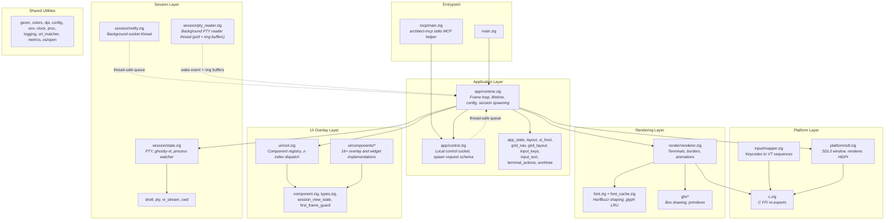

# Architecture

## System Overview

Architect is a **single-process, layered desktop application** built in Zig that functions as a grid-based terminal multiplexer optimized for multi-agent AI coding workflows. It follows a five-layer architecture: a thin entrypoint delegates to an application runtime that owns the frame loop, platform abstraction (SDL3), session management (PTY + ghostty-vt terminal emulation), scene rendering, and a component-based UI overlay system. The UI and terminal loop run on the main thread; background threads are used only for bounded auxiliary work (notification socket listener, local control socket listener, a PTY reader thread that drains session output into per-session ring buffers at wire speed, and quit-time agent-teardown worker). The frame loop uses a wakeable wait model: both idle and active-frame pacing block in SDL until either a wake-worthy event arrives or the relevant deadline expires, so PTY output, keystrokes, notification/control socket activity, and window events all interrupt the wait immediately instead of waiting out a fixed timeout. The application uses an action-queue pattern for UI-to-app mutations, request queues for external socket inputs, epoch-based cache invalidation for efficient rendering, and a vtable-based component registry for extensible UI overlays. Renderer cache entries are reused for both grid tiles and the steady-state full-screen terminal view; overlays remain live unless an effect needs them baked into the cached texture.

## Component Diagram


```mermaid
graph TD
    subgraph Entrypoint
        MAIN["main.zig"]
        MCP["mcp/main.zig<br/><i>architect-mcp stdio MCP helper</i>"]
    end

    subgraph Application Layer
        RT["app/runtime.zig<br/><i>Frame loop, lifetime, config, session spawning</i>"]
        CTRL["app/control.zig<br/><i>Local control socket, spawn request schema</i>"]
        APP_MODS["app_state, layout, ui_host,<br/>grid_nav, grid_layout, input_keys,<br/>input_text, terminal_actions, worktree"]
    end

    subgraph Platform Layer
        SDL["platform/sdl.zig<br/><i>SDL3 window, renderer, HiDPI</i>"]
        IM["input/mapper.zig<br/><i>Keycodes to VT sequences</i>"]
        CZIG["c.zig<br/><i>C FFI re-exports</i>"]
    end

    subgraph Session Layer
        SS["session/state.zig<br/><i>PTY, ghostty-vt, process watcher</i>"]
        SN["session/notify.zig<br/><i>Background socket thread</i>"]
        PW["session/pty_reader.zig<br/><i>Background PTY reader thread (poll + ring buffers)</i>"]
        SESSION_MODS["shell, pty, vt_stream, cwd"]
    end

    subgraph Rendering Layer
        REN["render/renderer.zig<br/><i>Terminals, borders, animations</i>"]
        FONT["font.zig + font_cache.zig<br/><i>HarfBuzz shaping, glyph LRU</i>"]
        GFX["gfx/*<br/><i>Box drawing, primitives</i>"]
    end

    subgraph UI Overlay Layer
        UR["ui/root.zig<br/><i>Component registry, z-index dispatch</i>"]
        UI_CORE["component.zig, types.zig,<br/>session_view_state, first_frame_guard"]
        COMPONENTS["ui/components/*<br/><i>16+ overlay and widget implementations</i>"]
    end

    subgraph Shared Utilities
        SHARED["geom, colors, dpi, config, env, clock, proc,<br/>logging, url_matcher, metrics, os/open"]
    end

    MAIN --> RT
    MCP --> CTRL
    RT --> APP_MODS
    RT --> CTRL
    RT --> SDL
    RT --> SS
    RT --> REN
    RT --> UR
    SS --> SESSION_MODS
    SN -.->|"thread-safe queue"| RT
    CTRL -.->|"thread-safe queue"| RT
    PW -.->|"wake event + ring buffers"| RT
    REN --> FONT
    REN --> GFX
    UR --> UI_CORE
    COMPONENTS --> UI_CORE
    IM --> CZIG
    SDL --> CZIG
    REN --> CZIG
```

## Dependency Rules

Dependencies flow strictly downward through the layer stack. No upward or lateral dependencies between peer layers except through the Application layer.

```
Entrypoint
    |
    v
Application Layer  (app/runtime.zig orchestrates everything below)
    |
    +-----------+-----------+-----------+
    |           |           |           |
    v           v           v           v
Platform    Session    Rendering    UI Overlay
    |                     |           |
    v                     v           v
              Shared Utilities
```

**Invariants:**
- Session, Rendering, and UI Overlay layers never import from each other directly. All cross-layer communication flows through the Application layer or shared types.
- UI components communicate with the application exclusively via the `UiAction` queue (never direct state mutation).
- `main(init: std.process.Init)` passes `init.io` to `runtime.run(io, ...)`, which threads it through the application, session, and UI layers. I/O-owning structs store it beside their allocator; worker contexts copy it when their thread outlives the spawner.
- Background threads are intentionally limited to four cases: the notification socket listener (`session/notify.zig`), the local control socket listener (`app/control.zig`), the PTY reader (`session/pty_reader.zig`), and a quit-time agent-teardown worker in `app/runtime.zig`. They communicate completion/state back to the main thread through thread-safe primitives. The notification listener and control listener block in `poll(2)` on the listening socket plus a `WakePipe` self-pipe (`src/wake_pipe.zig`); shutdown stores the stop flag and signals the pipe, so no thread ever sleeps in a fixed-interval loop. The notification listener, control listener, and PTY reader also post a custom SDL wake event after queueing work or draining PTY bytes, so the frame loop breaks out of `SDL_WaitEventTimeout(...)` promptly during both idle and active-frame pacing. The PTY reader polls the master fds of all spawned sessions with a ~100ms timeout and, when one becomes readable, drains it into that session's mutex-guarded ring buffer (`PtyOutputBuffer`, 1 MiB) — so producer processes are never backpressured by render pacing, and DEC-2026 sync windows close in the buffer as fast as the producer writes them. Sessions register their fd+buffer on spawn and retire it during teardown; reads happen only under the registry mutex, so `retire()` returning guarantees the reader can no longer touch the fd or buffer. The main thread's `processOutput` consumes from the buffer (VT parsing stays main-thread-only) and clears a shared `wake_pending` flag at the top of each frame; the reader posts at most one SDL wake event per frame via that flag.
- Shutdown order is UI-first for teardown dependencies: `UiRoot.deinit()` runs before session teardown so components that reference sessions are released while session memory is still valid.
- Runtime uses a one-shot teardown guard around UI cleanup so mixed `errdefer`/`defer` error unwind paths cannot deinitialize `UiRoot` twice.
- Runtime persistence is updated during the frame loop when runtime state changes (cwd changes, terminal spawn/despawn, window move/resize, font size changes), and finalization is explicit at the end of `app/runtime.zig`: final save and deinit `Persistence` before deferred subsystem teardown begins. Every change site only marks a dirty flag and records the time it first became dirty (`markPersistenceDirty`); the actual TOML write happens at most once per frame and only once the dirty state is at least 500ms old (`shouldSavePersistenceNow`), so a window drag or resize does not trigger a synchronous file write per mouse tick. The dirty timestamp is set once per dirty period (not refreshed by later changes), which caps the deferral at the debounce window even under continuous events.
- Restored window positions are validated after SDL initializes. A position is reused only when at least 32 pixels of the window remain reachable on the primary display; otherwise SDL chooses its normal default placement, allowing recovery after a monitor is disconnected.
- Font reload paths are transactional: acquire both replacement fonts first, then swap and destroy old fonts, so a partial reload failure cannot leave deinit hooks pointing at already-freed font resources.
- Window-resize scale handling follows a single ordered path (`reload-if-needed`, then `resize`) to keep behavior consistent between changed-scale and unchanged-scale events.
- Terminal resizes use Ghostty's minimal flow: a single `ioctl(master, TIOCSWINSZ)` on the PTY master, which the kernel pairs with a SIGWINCH to the foreground process group of the slave's controlling terminal. Each session is sized independently. The focused session in `.Full`/`.Expanding`/`.Collapsing` mode (and additionally the previous session during a panning transition) is sized to the full-window cell count; every other session stays at grid-cell size. Grid↔full view toggle therefore reflows exactly one session — the one the user actually zoomed — instead of every session in the workspace. Window resize, font size change, and grid layout change all flow through the same per-session dispatch (`fullSetForMode` in `app/runtime.zig`, `applyTerminalResize` with `Sizes`/`FullSet` in `app/layout.zig`). Grid sizing accounts for the user's grid font scale and the reserved CWD-bar space when computing tile cell count. When an application enables DEC mode 40 and switches DECCOLM (`\e[?3h`/`\e[?3l`), `applyTerminalResize` preserves the ghostty-vt logical 80/132-column width while the Architect layout target column count is unchanged; row and pixel-size changes still update the terminal model, and DEC 2048 in-band size reports use that logical model size with the latest pixel fields. A target column-count change resets the model to the computed grid/full size. While DEC mode 2026 (`\e[?2026h`) is active for a session, the renderer reuses the last cached texture for that session via `synchronizedOutputHoldsCache` in `render/renderer.zig` instead of refreshing from the in-progress vt model, so reflows from agents like Codex appear as one atomic frame change rather than a top-to-bottom rescroll. The hold is dropped when the cached composition mismatches the requested one (an overlay or wave needs to bake into the next frame) or when the app sends the closing `\e[?2026l`; the next frame after the close refreshes once and snaps to the final state. A timeout-based safety net in `session/state.zig` force-clears the mode if a session leaves `\e[?2026h` set without ever closing it. Beyond that per-batch 2026 hold, a resize is not hidden or animated in any way: the repaint an app performs in response to SIGWINCH renders live, frame by frame, exactly as it does in Ghostty. Agents differ widely in how they answer a resize — Claude repaints in a single burst that is over within tens of milliseconds, while codex erases its scrollback and re-prints its transcript tail as a paced multi-second stream — and that difference is the agent's behavior to own, not the terminal's to conceal. Architect deliberately carries no resize-settle hold, freeze, or sweep-reveal transition: an earlier implementation froze the pre-resize texture until output went quiet and then swept the new layout in, which cost a mandatory ~1.8 s of animation on every grid↔full toggle (a 400 ms silence debounce plus a 1400 ms sweep) to hide a repaint that fast agents had already finished, and which re-triggered on ordinary scrollback output because "a large output chunk shortly after a resize" cannot distinguish a repaint wave from the user simply scrolling. Showing the truth immediately is both simpler and more honest about what the app is doing.
- Shared Utilities (`geom`, `colors`, `dpi`, `config`, `env`, `clock`, `proc`, `logging`, `metrics`, etc.) may be imported by any layer but never import from layers above them. `env.zig` is the process-environment accessor, `clock.zig` supplies I/O-aware timestamps and sleep, and `proc.zig` wraps I/O-aware process execution.
- **Exception:** `app/*` modules may import `c.zig` directly for SDL type definitions used in input handling. This is a pragmatic shortcut for FFI constants, not a general license to depend on the Platform layer.

## Rules for New Code

These patterns are mandatory for all new code. They are derived from the architectural decisions (see ADRs below) and exist to prevent the most common structural violations.

1. **UI components use the vtable interface and communicate via UiAction queue.** Never mutate application state directly from a UI component. Push a `UiAction` to the queue; the main loop drains it after all component updates complete. (See ADR-003.)

2. **Render invalidation uses epoch comparison.** When terminal content changes, increment `render_epoch` on the `SessionState`. The renderer checks whether `presented_epoch` no longer matches `render_epoch` to know whether a session needs to be redrawn this frame, and cached session textures refresh when their stored epoch, overlay composition, or grid/full render mode no longer matches the requested render. This applies to both grid tiles and the steady-state full-screen terminal view. Never force a full re-render. (See ADR-004.) The dirty check only counts sessions visible in the current view mode (`RenderCache.sessionVisibleInMode`): in Full view, background sessions keep producing output but are never presented, so counting them would keep the app compositing and presenting full-window frames at the maximum rate for pixels nobody sees. Two related frame-loop rules: rendering is suppressed entirely while the window is occluded (`shouldRenderFrame` in `app/runtime.zig`) because macOS stops handing out `CAMetalLayer` drawables for covered windows and each render attempt would block the main thread — including PTY draining — for the full ~1s `nextDrawable` timeout; and static UI textures must never be created and destroyed within a single frame (see `ui/components/glyph_badge.zig`) because destroying a texture queued for rendering forces SDL's Metal backend to flush its command queue and acquire a drawable mid-frame.

3. **Blocking I/O goes on a background thread with a thread-safe queue.** The frame loop must never block. Any new external I/O source must follow the notification/control socket pattern: background thread + queue + main-loop drain. (See ADR-009.)

4. **Config vs. persistence separation.** User-editable preferences go in `config.toml`. Auto-managed runtime state (window position, recent folders, terminal cwds) goes in `persistence.toml`. Never mix them. (See ADR-010.)

5. **Use FirstFrameGuard for visibility transitions.** When a UI component moves to a visible state (modal opens, toast appears), call `markTransition()` and return `guard.wantsFrame()` from the component's `wantsFrame` method to bypass idle throttling. (See ADR-012.)

## Where to Put New Code

| I need to...                        | Put it in...                              |
|-------------------------------------|-------------------------------------------|
| Add a new UI element (overlay, dialog, widget) | `ui/components/`, implement `UiComponent` vtable, register in `UiRoot` |
| Add a new keyboard shortcut         | `ui/components/global_shortcuts.zig`      |
| Add terminal behavior or PTY logic  | `session/`                                |
| Add a rendering primitive           | `gfx/`                                    |
| Add a new config option             | `config.zig` + `config.toml` docs         |
| Add or change file logging behavior | `logging.zig` + `main.zig` (`std_options.logFn`) + `config.zig` |
| Add a new persisted runtime value   | `config.zig` (persistence section) + `persistence.toml` docs |
| Add cross-layer shared types        | Shared Utilities (`geom.zig`, `colors.zig`, etc.) |
| Add a new UiAction                  | `ui/types.zig` (tagged union) + handler in `app/runtime.zig` |
| Add notification-only external tool integration | `session/notify.zig` (extend notification protocol) |
| Add external control of app state   | `app/control.zig` + a runtime drain handler in `app/runtime.zig` |

## Data Flow

### I/O Carrier

```
main(init: std.process.Init)
    | init.io
    v
runtime.run(io, ...)
    | explicit parameter or stored field
    +--> application and session layers
    +--> UI components that perform I/O
    +--> copied into worker-thread contexts
```

### Frame Loop (per frame, ~16ms active / ~50ms idle)

```
                    +--------------------------------------+
                    | SDL_WaitEventTimeout()                |
                    | (idle: ~50ms budget, active: ~16ms;   |
                    |  returns early on any wake event)     |
                    +------------------+-------------------+
                                       | event or timeout
                                       v
                    +--------------------------------------+
                    |          SDL Event Queue              |
                    +------------------+-------------------+
                                       | drain
                                       v
                    +--------------------------------------+
                    |   Scale to render coordinates         |
                    +------------------+-------------------+
                                       |
                                       v
                    +--------------------------------------+
                    |   Build UiHost snapshot               |
                    |   (window size, grid, theme, etc.)    |
                    +------------------+-------------------+
                                       |
                                       v
                    +--------------------------------------+
                    |   ui.handleEvent()                    |
                    |   (topmost z-index first)             |
                    |   consumed? --- yes --> skip app logic|
                    +------------------+-------------------+
                                       | no
                                       v
                    +--------------------------------------+
                    |   App event switch                    |
                    |   (shortcuts, terminal input, resize) |
                    +------------------+-------------------+
                                       |
                                       v
                    +--------------------------------------+
                    |   xev loop iteration                  |
                    |   (async process exit detection)      |
                    +------------------+-------------------+
                                       |
                                       v
                    +--------------------------------------+
                    |   Clear PTY wake_pending flag          |
                    |   Drain session output -> ghostty-vt  |
                    |   Drain notification queue             |
                    |   (socket/PTY-reader threads can       |
                    |    post a wake event)                 |
                    +------------------+-------------------+
                                       |
                                       v
                    +--------------------------------------+
                    |   ui.update() + drain UiAction queue  |
                    |   (UI->app mutations applied here)    |
                    +------------------+-------------------+
                                       |
                                       v
                    +--------------------------------------+
                    |   Advance animation state             |
                    +------------------+-------------------+
                                       |
                                       v
                    +--------------------------------------+
                    |   renderer.render() -> scene          |
                    |   ui.render()       -> overlays       |
                    |   SDL_RenderPresent()                 |
                    +--------------------------------------+
```

### Terminal Output Path

```
Shell process
    | writes to PTY
    v
session.output_buf (kernel buffer -> userspace read)
    | processBytes()
    v
vt_stream.zig -> ghostty-vt parser
    | state machine updates
    v
Terminal cell buffer (content, attributes, colors)
    | session.render_epoch += 1
    v
Renderer cache dirty check (presented_epoch < render_epoch?)
    | yes -> re-render
    v
font.zig -> HarfBuzz shaping -> glyph textures
    |
    v
SDL_RenderTexture() -> frame presented
```

### Reader Mode Content Path

```
Focused terminal session
    | dump scrollback + viewport
    v
app/terminal_history.extractSessionText()
    | ANSI escape stripping
    v
Raw UTF-8 terminal history text
    | markdown parse
    v
ui/components/markdown_parser.DisplayBlock[]
    | line layout + wrapping
    v
ui/components/markdown_renderer.RenderLine[]
    | render as SDL text runs in centered reader column
    v
Reader overlay (live updates + search)
```

### Story Content Path

```
Story file notification (Unix socket)
    | session/notify.zig delivers path
    v
story_overlay.zig reads file from disk
    | markdown parse (story mode)
    v
ui/components/markdown_parser.parseStory()
    | story-diff blocks, anchors, code refs, prose
    v
ui/components/markdown_parser.DisplayBlock[]
    | line layout + wrapping
    v
ui/components/markdown_renderer.buildLines()
    | RenderLine[] with story-specific kinds
    v
Story overlay (on-the-fly font rendering, anchor badges, bezier arrows, search, clickable links)
```

### Terminal Input Path

```
Physical keyboard
    |
    v
SDL_EVENT_KEY_DOWN / SDL_EVENT_TEXT_INPUT
    | scaled to render coordinates
    v
UiRoot.handleEvent() (components by z-index)
    | not consumed
    v
App event switch -> shortcut detection
    | not a shortcut
    v
input/mapper.zig -> encodeKey() -> VT escape sequence bytes
    |
    v
session.pending_write buffer
    | next frame
    v
PTY write() -> shell process stdin
```

### Pull Request Listing Path

```
Focused cwd changes -> pr_dropdown component
    | check .git/config -> origin URL contains "github.com"?
    | check .git/HEAD -> current branch
    v
GitHub repo -> startFetch() creates a repository-keyed worker job even while
the overlay is collapsed, so the pill can resolve the current branch badge
    |
    v
Cmd+P pressed -> PRDropdownComponent.openOverlay()
    | startFetch() creates a repository-keyed worker job when data is stale
    v
Worker thread: gh pr list --state open --json number,title,headRefName
    | parse JSON
    | write FetchResult into that job's mutex-protected context
    | atomic.store(job.done, true)
    v
Main loop next frame:
    | wantsFrame() returns true for completed jobs
    | update() joins completed workers and collects their contexts
    | apply only the result whose repository matches the focused repo
    | discard stale results from repositories that are no longer focused
    v
Render overlay with PR titles + branch matching for current PR badge
    | refresh .git/HEAD on each update so branch checkouts update the badge

On Enter / click:
    | emit UiAction.CheckoutPullRequest { session, pr_number, branch }
    v
runtime.zig dispatch: send `gh pr checkout <number>\n` to the focused shell
```

### External Notification Path

```
External tool (Claude Code, Codex, Gemini)
    | JSON over Unix socket
    v
session/notify.zig (background thread)
    | parse {"session": N, "state": "awaiting_approval"}
    | or    {"session": N, "type": "story", "path": "/abs/path"}
    v
NotificationQueue (thread-safe)
    | main loop drains each frame
    v
Status notifications -> SessionStatus updated (idle -> awaiting_approval)
Story notifications  -> StoryOverlay opens with file content
    |
    v
Renderer draws attention border / story overlay
```

### External MCP Spawn Path

```
MCP client
    | launches architect-mcp over stdio
    v
src/mcp/main.zig
    | JSON-RPC initialize/tools/list/tools/call
    | validates spawn_session arguments
    v
app/control.zig
    | scans per-instance discovery files in XDG_RUNTIME_DIR or stable per-user runtime dir
    | connects to architect_control_<pid>.sock
    v
Control socket listener thread in the running app
    | parses request and queues PendingSpawn
    | posts SDL wake event
    v
app/runtime.zig main loop
    | validates cwd, chooses or expands a grid slot
    | calls SessionState.ensureSpawnedWithDir()
    | queues optional command into pending_write
    v
Control response
    | status + session_id + slot_index, or stable error code
    v
architect-mcp MCP tool result
```

### Logging Path

```
std.log.scoped(...) callsite
    | compile-time scope + level
    v
main.zig std_options.logFn -> logging.zig
    | runtime min-level filter from [logging].min_level
    v
Structured log line (local timestamp with timezone offset, level, scope, msg, optional fields)
    | append to active file
    v
~/Library/Logs/Architect/architect.log (macOS)
    | if size > 10 MiB
    v
Rotate: rename active file to architect-<UTC timestamp>.log and continue in new active file
```

### Entry Points

| Entry Point | Source | Description |
|------------|--------|-------------|
| SDL event queue | Keyboard, mouse, window events | Primary user interaction |
| PTY read | Shell process stdout/stderr | Terminal content updates |
| Unix domain socket | External AI tools | Status notifications (JSON) |
| Unix domain socket | `architect-mcp` | Local `spawn_session` control requests |
| Config files | `~/.config/architect/` | Startup configuration and persistence |

### Storage

| Store | Location | Contents |
|-------|----------|----------|
| Terminal cell buffer | In-memory (ghostty-vt) | Current screen + scrollback (up to 10KB default) |
| Glyph cache | GPU textures + in-memory LRU | Up to 4096 shaped glyph textures |
| Render cache | GPU textures per session | Cached terminal renders, epoch-invalidated |
| config.toml | `~/.config/architect/config.toml` | User preferences (font, theme, UI flags, worktree location) |
| persistence.toml | `~/.config/architect/persistence.toml` | Runtime state (window pos, font size, terminal cwds, agent session IDs, onboarding state) |
| architect.log + archives | `~/Library/Logs/Architect/` | Structured application logs with size-based rotation (10 MiB active-file threshold) |
| diff_comments.json | `<repo>/.architect/diff_comments.json` | Per-repo inline diff review comments (unsent) |
| architect_control_<uid>_<pid>.json | `XDG_RUNTIME_DIR`, or `~/Library/Caches/Architect/runtime` on macOS / `~/.cache/architect/runtime` elsewhere | Per-instance discovery file pointing `architect-mcp` at a running app's local control socket |

### Exit Points

| Exit Point | Destination | Description |
|------------|-------------|-------------|
| PTY write | Shell process stdin | Encoded keyboard input |
| SDL renderer | Display | Rendered frames via GPU |
| Config write | Filesystem | Persisted window state and terminal cwds on quit |
| Log write | Filesystem | Structured log append and size-based rotation |
| URL open | OS browser | Cmd+Click hyperlinks via `os/open.zig` |

## Module Boundary Table

| Module | Responsibility | Public API (key functions/types) | Dependencies |
|--------|---------------|----------------------------------|--------------|
| `main.zig` | Thin entrypoint + global logging hook registration | `main(init: std.process.Init)`, `std_options.logFn` | `app/runtime`, `logging` |
| `mcp/main.zig` | Separate `architect-mcp` stdio MCP server. Handles JSON-RPC lifecycle methods and exposes the single `spawn_session` tool. | `main(init: std.process.Init)`, `run()` | `app/control` module import, std |
| `app/runtime.zig` | Application lifetime, frame loop, session spawning, config persistence, logging lifecycle/view-transition markers | `run(io, ...)`, frame loop internals | `platform/sdl`, `session/state`, `render/renderer`, `ui/root`, `config`, `logging`, all `app/*` modules |
| `app/control.zig` | Local control channel shared by the app and `architect-mcp`: spawn request schema, discovery file, Unix socket listener, request queue, and response serialization | `SpawnRequest`, `SpawnResponse`, `SpawnQueue`, `startControlThread()`, `connectAndSendSpawnRequest()` | std (socket, thread, JSON) |
| `app/terminal_history.zig` | Extract focused terminal scrollback + viewport text, strip ANSI escape sequences, convert OSC 133 prompt markers into reader-friendly prompt marker lines, and extract agent session IDs from PTY output for resumption | `extractSessionText()`, `extractTerminalText()`, `stripAnsiAlloc()`, `extractAgentSessionId()`, `buildResumeCommand()` | `session/state`, `ghostty-vt`, std |
| `app/*` (app_state, layout, ui_host, grid_nav, grid_layout, input_keys, input_text, terminal_actions, worktree) | Application logic decomposed by concern: state enums, grid sizing, UI snapshot building, navigation, input encoding, clipboard and submitted-paste construction, worktree commands (with configurable external directory and post-create init) | `ViewMode`, `AnimationState`, `SessionStatus`, `buildUiHost()`, `applyTerminalResize()`, `encodeKey()`, `pasteText()`, `buildSubmittedPaste()`, `clearTerminal()`, `resolveWorktreeDir()` | `geom`, `anim/easing`, `ui/types`, `ui/session_view_state`, `colors`, `input/mapper`, `session/state`, `c` |
| `platform/sdl.zig` | SDL3 initialization, window management, HiDPI | `init()`, `createWindow()`, `createRenderer()` | `c` |
| `input/mapper.zig` | SDL keycodes to VT escape sequences, shortcut detection | `encodeKey()`, modifier helpers | `c` |
| `c.zig` | C FFI re-exports (SDL3, SDL3_ttf constants) | `SDLK_*`, `SDL_*`, `TTF_*` re-exports | SDL3 system libs (via `@cImport`) |
| `session/state.zig` | Terminal session lifecycle: PTY, ghostty-vt, process watcher, foreground agent detection, graceful agent teardown at quit, and main-thread ring-buffer consumption | `SessionState`, `AgentKind`, `init()`, `despawn()`, `deinit()`, `ensureSpawnedWithDir()`, `processOutput()`, `render_epoch`, `pending_write`, `detectForegroundAgent()`, `sendTermToForegroundPgrp()` | `shell`, `pty`, `pty_reader`, `vt_stream`, `cwd`, `font`, xev |
| `session/notify.zig` | Background notification socket thread and queue; handles status and story notifications | `NotificationQueue`, `Notification` (union: status/story), `startThread()`, `push()`, `drain()` | std (socket, thread) |
| `session/pty_reader.zig` | Background thread that `poll(2)`s spawned sessions' PTY master fds and drains readable ones into per-session SPSC ring buffers; registry with retire handshake so teardown can safely close fds | `PtyReader`, `PtyOutputBuffer`, `start()`, `register()`, `retire()` | std (poll, thread) |
| `wake_pipe.zig` | Non-blocking self-pipe used to wake blocking background-thread polls during shutdown | `WakePipe`, `poll_error_backoff_ns` | `posix_util`, std (poll) |
| `session/*` (shell, pty, vt_stream, cwd) | Shell spawning, PTY abstraction, VT parsing, working directory detection | `spawn()`, `Pty`, `VtStream.processBytes()`, `getCwd()` | std (posix), ghostty-vt |
| `render/renderer.zig` | Scene rendering: terminals, borders, animations, terminal scrollbar painting, first-launch onboarding hint | `render()`, `RenderCache`, per-session texture management | `font`, `font_cache`, `gfx/*`, `anim/easing`, `app/app_state`, `ui/components/scrollbar`, `c` |
| `font.zig` + `font_cache.zig` | Font rendering, HarfBuzz shaping, glyph LRU cache, shared font cache | `Font`, `openFont()`, `renderGlyph()`, `FontCache`, `getOrCreate()` | `font_paths`, `c` (SDL3_ttf) |
| `gfx/*` (box_drawing, primitives) | Procedural box-drawing characters (U+2500-U+257F), rounded/thick border helpers, bezier arrow rendering | `renderBoxDrawing()`, `drawRoundedRect()`, `drawThickBorder()`, `fillRoundedRect()`, `renderBezierArrow()` | `c` |
| `env.zig`, `clock.zig`, `proc.zig` | Process-environment access, I/O-aware timestamps/sleep, and I/O-aware process execution helpers | `get()`, `now*()`, `sleepNanos()`, `run()`, `spawnDetached()` | std |
| `ui/root.zig` | UI component registry, z-index dispatch, action drain | `UiRoot`, `register()`, `handleEvent()`, `update()`, `render()`, `needsFrame()` | `ui/component`, `ui/types` |
| `ui/component.zig` | UI component vtable interface | `UiComponent`, `VTable` (handleEvent, update, render, hitTest, wantsFrame, deinit) | `ui/types`, `c` |
| `ui/types.zig` | Shared UI type definitions | `UiHost`, `UiAction`, `UiActionQueue`, `UiAssets`, `SessionUiInfo` | `app/app_state`, `colors`, `font`, `geom` |
| `ui/session_view_state.zig` | Per-session UI interaction state (selection, scroll, hover, agent status, scrollbar fade/drag state) | `SessionViewState` (selection, scroll offset, hover, status, terminal scrollbar state) | `app/app_state` (for `SessionStatus` enum), `ui/components/scrollbar` |
| `ui/first_frame_guard.zig` | Idle throttle bypass for visible state transitions | `FirstFrameGuard`, `markTransition()`, `markDrawn()`, `wantsFrame()` | (none) |
| `ui/text_edit.zig` | Shared text-field model used by every input (worktree name, recent-folder/reader/story search, diff comments). `TextInput` owns the buffer, caret blink phase and select-all flag, and handles Backspace (⌘ clears / ⌥ word / plain one UTF-8 codepoint), ⌘A, ⌘C and ⌘V. Append-only by design: the caret sits at the end and the only selection is "everything". Components keep layout and rendering, reading `caretVisible()`/`select_all` for the visuals. | `TextInput`, `handleKey()`, `insert()`, `caretVisible()`, `touch()`, `DeleteScope`, `scopeFromMods()`, `backspace()`, `isSingleLineChar()`, `name_separators`, `path_separators`, `prose_separators` | `c` (keycodes, clipboard) |
| `ui/text_render.zig` | Emoji-aware single-line text rendering plus overflow handling for UI fields. Apple Color Emoji is a non-scalable bitmap font with one 160 px strike, so a string rendered through the attached fallback comes back ~160 px tall; this splits a line into emoji and text runs, scales the emoji runs by the ascent ratio — the emoji surface is the emoji font's whole line box, so scaling it to the text line height instead lands the glyph off the baseline — and composes them (the UI equivalent of the per-glyph cell scaling in `font.zig`). `drawClippedTail` keeps an overflowing line inside its field, tail-aligned so the caret stays visible, with a fade over the leading edge. | `TextTex`, `LineFonts`, `makeTextTexture()`, `drawClippedTail()`, `EdgeFade` | `c` (SDL_ttf, surfaces), `geom` |
| `ui/components/markdown_parser.zig` | Shared markdown parser for reader mode and story overlays. Parses headings, paragraphs, lists (including task checkboxes), blockquotes, markdown tables, fenced code, horizontal rules, inline styles (bold/italic/code/strikethrough/link), and prompt separator blocks. In story mode (`parseStory()`), additionally handles `story-diff` fenced blocks, code block metadata JSON, anchor extraction (`**[N]**` in prose, `<!--ref:N-->` in code), and per-line paragraph emission. | `parse()`, `parseStory()`, `freeBlocks()`, `DisplayBlock`, `StyledSpan`, `CodeBlockMeta`, `CodeLineKind`, `ParseOptions` | std |
| `ui/components/markdown_renderer.zig` | Line layout engine that wraps parsed markdown blocks into renderable lines and style runs, including prompt-separator and story-specific line kinds (diff headers, diff lines, code lines with anchor/kind metadata) | `buildLines()`, `freeLines()`, `RenderLine`, `RenderRun` | `ui/components/markdown_parser` |
| `ui/components/search_utils.zig` | Shared search utilities for overlays: case-insensitive substring find, match rebuilding, search bar rendering, and text texture creation | `SearchMatch`, `TextTex`, `findCaseInsensitive()`, `rebuildMatches()`, `renderSearchBar()`, `makeTextTexture()` | `gfx/primitives`, `font_cache`, `dpi`, `geom`, `c` |
| `ui/components/reader_overlay.zig` | Fullscreen reader overlay for the selected terminal history (full view or grid selection) with live markdown updates, centered reading-width layout, bottom pinning, jump-to-bottom, incremental search, clickable links, shared scrollbar interactions, styled inline markdown in table cells, and left-to-right gradient prompt separators | `ReaderOverlayComponent`, `toggle()` | `ui/components/fullscreen_overlay`, `ui/components/scrollbar`, `ui/components/search_utils`, `app/terminal_history`, `ui/components/markdown_parser`, `ui/components/markdown_renderer`, `os/open`, `font_cache`, `geom`, `c` |
| `ui/components/modal_frame.zig` | Shared chrome for centered modal dialogs: full-window darkening scrim + rounded filled/bordered panel, and the Escape/⌘W dismiss-key check. Used by `confirm_dialog.zig` and `selection_agent_overlay.zig` so their scrim/panel rendering and dismissal keys can't drift independently | `renderScrimAndPanel()`, `isDismissKey()` | `gfx/primitives`, `geom`, `c` |
| `ui/components/dropdown_menu.zig` | Reusable vertical list menu: owns open/hover/keyboard-nav state and the committed `selected` index, renders its own cached item-label textures, and reports a `.selected`/`.closed` event on click or Enter/Escape so the owning component reacts (persist the pick, or act on it immediately) instead of tracking hit-testing and highlight rendering itself. Used by `selection_agent_overlay.zig`'s agent selector and `diff_overlay.zig`'s "Send to agent" menu | `DropdownMenu`, `openMenu()`, `close()`, `handleKey()`, `handleClick()`, `handleMotion()`, `itemAt()`, `itemRect()`, `render()` | `gfx/primitives`, `font_cache`, `ui/text_render`, `geom`, `c` |
| `ui/components/selection_agent_overlay.zig` | Selection action form with highlighted agent selector, multiline prompt field, fully wrapped and scrollable selected-context preview, viewport-bounded context textures, cached UI text, and launch action containing the selected terminal context | `SelectionAgentOverlayComponent`, `open()`, `formatAgentPrompt()` | `ui/text_edit`, `ui/text_render`, `ui/first_frame_guard`, `ui/components/modal_frame`, `ui/components/dropdown_menu`, `ui/components/scrollbar`, `gfx/primitives`, `font_cache`, `geom`, `c` |
| `ui/components/*` | Individual overlay and widget implementations conforming to `UiComponent` vtable. Includes: help overlay, worktree picker, recent folders picker (with instant search filtering), PR dropdown, diff viewer (with inline review comments), story viewer (PR story file visualization with rich markdown, anchor badges, bezier arrows, clickable links, and Cmd+F search — uses shared markdown parser/renderer pipeline and shared search utilities), reader mode overlay (uses shared search utilities), fullscreen overlay helper (shared animation/scroll/close logic embedded by story, diff, and reader overlays), reusable aqua-style scrollbar widget, session interaction, toast, quit confirm, quit-blocking overlay, restart buttons, escape hold indicator, metrics overlay, global shortcuts, pill group, cwd bar, expanding overlay helper (badge-to-panel animation; `State.isOpenOrOpening()` is the canonical "this overlay owns the keyboard and is visible" test, so input is never dropped during the expand), button, confirm dialog (shares its scrim/panel chrome and dismiss-key check with the selection-agent overlay via `ui/components/modal_frame`), marquee label, hotkey indicator, flowing line, hold gesture detector. | Each component implements the `VTable` interface; overlays toggle via keyboard shortcuts or external commands and emit `UiAction` values. | `ui/component`, `ui/types`, `anim/easing`, `font`, `metrics`, `url_matcher`, `ui/session_view_state` |
| `ui/components/pr_dropdown.zig` | GitHub pull request picker orchestration: owns focused-repository state, input/lifecycle handling, repository-keyed worker jobs, stale-result filtering, branch badges, and checkout actions | `PRDropdownComponent` | `ui/components/pr_dropdown_model`, `ui/components/pr_dropdown_repo`, `ui/components/pr_dropdown_fetch`, `ui/components/pr_dropdown_view`, `ui/components/expanding_overlay`, `ui/components/search_utils`, `ui/text_edit`, `ui/types`, `geom`, `c` |
| `ui/components/pr_dropdown_model.zig` | Pull request and fetch result types plus pure repository/result matching predicates | `PullRequest`, `FetchStatus`, `FetchResult`, `freeFetchResult()`, `prNumberForBranch()` | std |
| `ui/components/pr_dropdown_repo.zig` | Synchronous repository discovery: `.git` and worktree config/HEAD resolution and GitHub origin detection | `findRepoRoot()`, `detectGithubOrigin()`, `readCurrentBranch()`, `originUrlIsGithub()` | std |
| `ui/components/pr_dropdown_fetch.zig` | `gh pr list` process execution, bounded diagnostic previews, ANSI normalization, and JSON parsing | `runGhPrList()`, `parseGhJson()` | `pr_dropdown_model`, std |
| `ui/components/pr_dropdown_view.zig` | Pull request pill and dropdown rendering, cached textures, label truncation/highlighting, and render-state projection | `Cache`, `RenderState`, `ensureCache()`, `renderGlyph()`, `renderOverlay()` | `pr_dropdown_model`, `flowing_line`, `search_utils`, `font_cache`, `geom`, `ui/types`, `ui/text_edit`, `colors`, `dpi`, `c` |
| `logging.zig` | File-backed structured logger with runtime level filtering and size-based rotation | `init()`, `deinit()`, `logFn()`, `writeEvent()`, `writeStartupMarker()`, `writeShutdownMarker()` | std |
| Shared Utilities (`geom`, `colors`, `dpi`, `config`, `logging`, `metrics`, `url_matcher`, `os/open`, `anim/easing`) | Geometry primitives, theme/palette management, DPI scaling helpers, TOML config loading/persistence, file-backed logging, performance metrics (including frame-loop and cache-refresh counters), URL detection, cross-platform URL opening, easing functions | `Rect`, `Theme`, `Config`, `logFn`, `Metrics`, `dpi.scale()`, `matchUrl()`, `open()`, `easeInOutCubic()`, `easeOutCubic()` | std, zig-toml, `c` |

## Key Architectural Decisions

### ADR-001: Five-Layer Single-Thread Architecture

- **Decision:** Organize the application into five layers (entrypoint, platform, session, rendering, UI overlay) running on a single main thread with bounded background threads only for blocking external I/O and quit-time agent teardown.
- **Context:** A terminal multiplexer needs tight control over frame timing, event ordering, and GPU resource management. Multi-threaded rendering introduces synchronization complexity without clear benefit for a UI-bound application. Notification and control sockets are isolated on listener threads because their accept/read paths must not block the frame loop.
- **Alternatives considered:**
  - *Multi-threaded rendering* -- rejected because SDL3 renderers are not thread-safe, and the complexity of synchronizing terminal state across threads outweighs the marginal throughput gain.
  - *Async I/O everywhere* -- rejected because the frame loop is inherently synchronous (poll, update, render, present), and async patterns add indirection without improving latency for a 60 FPS UI.
- **Date:** 2025 (initial architecture)

### ADR-002: Component-Based UI Overlay System with VTable Dispatch

- **Decision:** UI overlays are implemented as components registered with a central `UiRoot` registry, each conforming to a `VTable` interface (handleEvent, update, render, hitTest, wantsFrame, deinit). Components are dispatched by z-index, highest first.
- **Context:** The application has 16+ distinct UI elements (help overlay, worktree picker, diff viewer, reader mode, toast, quit dialog, etc.) that need independent lifecycle management, event handling priority, and rendering order. A centralized registry prevents ad-hoc event handling scattered across the main loop.
- **Alternatives considered:**
  - *Immediate-mode GUI* -- rejected because retain-mode components with cached textures reduce per-frame CPU work, and the vtable pattern is idiomatic in Zig for polymorphic dispatch.
  - *Ad-hoc event handling in main.zig* -- rejected because it leads to unmaintainable event switch growth as UI features are added; the component pattern isolates concerns.
- **Date:** 2025 (initial architecture)

### ADR-003: UiAction Queue for UI-to-App Mutations

- **Decision:** UI components never mutate application state directly. Instead, they push `UiAction` values (a tagged union) to a queue that the main loop drains after all component updates complete.
- **Context:** Direct mutation from UI components would create ordering dependencies between components and the main loop. A queue decouples intent from execution, making it safe to add/remove/reorder components without breaking state transitions.
- **Alternatives considered:**
  - *Direct callback functions* -- rejected because callbacks create implicit coupling and make it hard to reason about mutation ordering.
  - *Event bus / pub-sub* -- rejected as over-engineered for a single-process application; a simple queue with a typed union is sufficient and type-safe.
- **Date:** 2025 (initial architecture)

### ADR-004: Epoch-Based Render Cache Invalidation

- **Decision:** Each `SessionState` maintains a monotonic `render_epoch` counter that increments on terminal content changes. The renderer's `RenderCache` tracks the last presented epoch per session and only re-renders when epochs diverge.
- **Context:** Re-rendering all terminal cells every frame is expensive (glyph shaping, texture creation). Most frames in a multi-terminal grid have no changes in most sessions. Epoch comparison is O(1) per session and avoids deep content diffing.
- **Alternatives considered:**
  - *Dirty-flag per cell* -- rejected because tracking individual cell changes is memory-intensive and the granularity is unnecessary when the renderer caches entire session textures.
  - *Timer-based refresh* -- rejected because it wastes GPU cycles re-rendering unchanged terminals and introduces visible latency for changed ones.
- **Date:** 2025 (initial architecture)

### ADR-005: ghostty-vt for Terminal Emulation

- **Decision:** Use ghostty-vt (from the Ghostty terminal project) as the VT state machine and ANSI parser rather than implementing one from scratch.
- **Context:** Terminal emulation is a complex domain with thousands of edge cases (escape sequences, Unicode handling, alternate screen buffers, scrollback, etc.). ghostty-vt is a mature, well-tested implementation written in Zig, making it a natural fit for a Zig application.
- **Alternatives considered:**
  - *Custom VT parser* -- rejected because building a correct VT100/xterm-compatible parser is a multi-year effort and a maintenance burden orthogonal to the product goal.
  - *libvterm (C library)* -- rejected because it requires C FFI overhead and memory management coordination; ghostty-vt integrates natively with Zig's type system and allocator model.
- **Date:** 2025 (initial dependency choice)

### ADR-006: SDL3 for Rendering and Input

- **Decision:** Use SDL3 as the platform abstraction layer for window management, GPU-accelerated 2D rendering, input events, and font rendering (via SDL3_ttf with HarfBuzz).
- **Context:** The application needs cross-platform window management, hardware-accelerated texture rendering, and HiDPI support. SDL3 provides all of these with a C API that Zig can import directly via `@cImport`.
- **Alternatives considered:**
  - *Native platform APIs (AppKit/Metal)* -- rejected because it locks the project to macOS; SDL3 allows future Linux/Windows porting.
  - *Vulkan/OpenGL directly* -- rejected because 2D terminal rendering does not need low-level GPU control, and SDL3's renderer API is sufficient and simpler.
  - *Electron / web-based* -- rejected for performance and resource usage; a native Zig application has sub-millisecond event latency and minimal memory overhead.
- **Date:** 2025 (initial dependency choice)

### ADR-007: Lazy Session Spawning

- **Decision:** Only session 0 spawns a shell process on startup. Additional sessions spawn on first user interaction (click or keyboard navigation).
- **Context:** Users may configure a grid with many slots but only actively use a few. Eagerly spawning all shells wastes system resources (PTY file descriptors, process table entries, memory for terminal buffers) and slows startup.
- **Alternatives considered:**
  - *Eager spawn all* -- rejected because startup time scales linearly with session count, and unused PTYs waste kernel resources.
  - *Spawn on first output* -- rejected because sessions need a shell to produce output; spawn-on-interaction is the natural trigger.
- **Date:** 2025 (initial design)

### ADR-008: Procedural Box-Drawing Characters

- **Decision:** Box-drawing characters (U+2500-U+257F) are rendered procedurally via line/rectangle primitives rather than using font glyphs.
- **Context:** Font-based box-drawing characters often have alignment issues: gaps between cells, inconsistent line widths, or mismatched metrics across font families. Procedural rendering guarantees pixel-perfect alignment regardless of the chosen font.
- **Alternatives considered:**
  - *Font glyph rendering* -- rejected because alignment varies by font and size; even monospace fonts often have subpixel gaps in box-drawing characters.
  - *Pre-rendered sprite atlas* -- rejected because it doesn't scale with DPI or font size changes.
- **Date:** 2025 (rendering implementation)

### ADR-009: Thread-Safe Notification Queue for External Tool Integration

- **Decision:** External AI tools communicate with Architect via a Unix domain socket. A dedicated background thread accepts connections, parses single-line JSON messages, and pushes to a thread-safe queue. The main loop drains this queue once per frame.
- **Context:** AI coding agents (Claude Code, Codex, Gemini) need to signal state changes (start, awaiting_approval, done) to trigger visual indicators. Socket I/O must not block the render thread, but state updates must be applied synchronously during the frame loop to avoid race conditions with rendering.
- **Alternatives considered:**
  - *Polling a file or pipe* -- rejected because it introduces latency and filesystem overhead; sockets provide immediate delivery.
  - *D-Bus or platform IPC* -- rejected because it adds platform-specific dependencies; Unix domain sockets are simple and portable across macOS and Linux.
  - *Direct main-thread socket polling* -- rejected because accept/read can block; a background thread with a lock-free queue provides non-blocking integration.
- **Date:** 2025 (notification system implementation)

### ADR-010: TOML-Based Dual Configuration (User Prefs + Runtime State)

- **Decision:** Configuration is split into two TOML files: `config.toml` for user-editable preferences (font, theme, UI flags) and `persistence.toml` for auto-managed runtime state (window position, font size, terminal cwds, recent folders).
- **Context:** Mixing user preferences with volatile runtime state in a single file leads to merge conflicts and confusion when users manually edit configuration. Separating them allows `config.toml` to be version-controlled or shared, while `persistence.toml` is machine-specific and auto-managed.
- **Alternatives considered:**
  - *Single config file* -- rejected because auto-saving window position into a user-edited file causes unexpected diffs.
  - *JSON or YAML* -- rejected because TOML is designed for configuration files, has clear section semantics, and the zig-toml library provides native Zig integration without C FFI.
  - *SQLite for persistence* -- rejected as over-engineered for a handful of key-value pairs; TOML is human-readable and easy to debug.
- **Date:** 2025 (configuration system implementation)

### ADR-011: Hardcoded Keybindings

- **Decision:** All keyboard shortcuts are hardcoded in the source code. There is no user-configurable keybinding system.
- **Context:** The application has a small, focused set of shortcuts (Cmd+N, Cmd+W, Cmd+T, Cmd+D, Cmd+R, Cmd+/, Cmd+1-0, Cmd+Return, Cmd+Q, plus overlay-local bindings like Cmd+F in reader mode). A configurable keybinding system adds significant complexity (parser, conflict detection, documentation generation) for marginal user benefit at this stage.
- **Alternatives considered:**
  - *Config-driven keybindings* -- deferred, not rejected; may be added as the shortcut set grows, but current simplicity is preferred during early development.
- **Date:** 2025 (input system implementation)

### ADR-012: FirstFrameGuard Pattern for Idle Throttle Bypass

- **Decision:** When a UI component transitions to a visible state (modal opens, gesture starts), it uses a `FirstFrameGuard` to signal the frame loop that an immediate render is needed, bypassing idle throttling.
- **Context:** The frame loop throttles to ~20 FPS when idle (no terminal output or user input). Without the guard, newly visible UI elements would appear with up to 250ms delay, creating a perceived lag. The guard ensures the first frame of a transition renders immediately.
- **Alternatives considered:**
  - *Always render at full rate* -- rejected because it wastes CPU/GPU when nothing is changing, impacting battery life on laptops.
  - *SDL event injection* -- rejected because synthetic events pollute the event queue and complicate event handling logic.
- **Date:** 2025 (UI system refinement)

### ADR-013: Synchronous I/O in UI Overlays for Git and Small-File Persistence

- **Decision:** UI overlay components may perform synchronous I/O on the main thread for two categories of operations: (1) running short-lived `git` commands (e.g., `git diff`, `git rev-parse`) whose output is needed immediately for rendering, and (2) reading/writing small per-repo data files (e.g., `<repo>/.architect/diff_comments.json`).
- **Context:** The diff overlay needs `git diff` output to render its content and persists inline review comments as a small JSON file. ADR-009 establishes that blocking I/O should go on a background thread, but these operations complete in single-digit milliseconds for typical repositories and small data files. Introducing a background thread with a callback-based rendering pipeline for each git command would add significant complexity (deferred rendering, loading states, race conditions with overlay visibility) for negligible latency improvement.
- **Constraints:** This exception applies only when the data is small and the command is fast. Large or potentially slow operations (e.g., network I/O, cloning, `git log` on deep histories, `gh pr list` which hits the network) must still use the background thread pattern from ADR-009. The PR dropdown follows this rule: detection of a GitHub origin and the current branch is a synchronous read of `.git/config` and `.git/HEAD` on the main thread, but the actual `gh pr list` invocation runs on a worker thread spawned per-open with results delivered through a mutex-guarded slot and atomic completion flag.
- **Alternatives considered:**
  - *Background thread + queue for all git commands* -- deferred; would require deferred rendering with loading states in the overlay, adding complexity disproportionate to the latency risk. May be revisited if git operations become noticeably slow on large repositories.
  - *Lazy/cached persistence* -- partially adopted; comments are only saved on overlay close and on comment submit, not on every keystroke.
- **Date:** 2025 (diff overlay inline comments)

### ADR-014: Agent Session Detection, Persistence, and Resumption

- **Decision:** Architect detects running AI agents at quit time, captures their session UUIDs, persists them in `persistence.toml`, and automatically resumes them on next launch. The quit-time teardown runs asynchronously on a background worker thread while the main thread keeps rendering terminal updates.
- **Context:** To persist an agent's session ID for resumption on next launch, Architect must capture the session UUID that the agent prints to the PTY during graceful shutdown. The quit sequence is: detect running agent via macOS `sysctl`/process inspection → start a background teardown worker → worker launches one teardown task per detected agent session in parallel; each task injects `Ctrl+C` twice (all supported agents), waits, retries once, and finally sends SIGTERM as last resort → main thread continues polling PTY output/rendering terminals (including post-exit PTY drain only for sessions with active quit capture while they are still allocated), so users can see agents stopping in real time and trailing output is not dropped → a full-screen `quit_blocking_overlay` blocks all input and renders a shimmering gray veil while teardown is in progress → after worker completion, runtime performs a bounded drain-until-quiet pass over all affected PTYs to capture trailing output that arrived after the worker reported done → Architect extracts UUIDs only from PTY bytes captured after shutdown begins (not full history) and persists successful captures to `persistence.toml`.
- **Agent detection strategy:** `session/state.detectForegroundAgent()` reads the foreground process-group leader's process image name (`kp_proc.p_comm`) via `sysctl KERN_PROC_PID`. If `p_comm` is `"claude"`, `"codex"`, or `"gemini"`, the agent is identified directly. If `p_comm` is `"node"`, `KERN_PROCARGS2` is read to inspect `argv[1]`; if the script path contains `"claude"`, `"codex"`, or `"gemini"`, the corresponding agent is matched. This uniform approach covers both direct binaries and Node.js-wrapped agents.
- **Resume-command injection:** On next launch, `app/runtime.zig` reads the persisted `agent_type` and `agent_session_id` from `persistence.toml`. If both are present, it appends the resume command (e.g., `claude --resume <uuid>`) to `session.pending_write` immediately after spawning the shell. The shell reads this input once it is ready, so no timing synchronization is needed.
- **Layer boundary:** `app/runtime.zig` owns quit orchestration (worker lifecycle, PTY exit signaling by fd, persistence timing) and UI blocking state. `session/state.zig` owns agent detection and session metadata access. `app/terminal_history.zig` owns text analysis (UUID extraction). UI components (`ui/components/quit_blocking_overlay.zig`) own the visual/input lock behavior.
- **Alternatives considered:**
  - *Synchronous main-thread teardown with blocking reads* -- rejected because it freezes UI rendering during agent shutdown and obscures progress from users.
  - *OSC/socket notification from agents* -- rejected because it requires agents to support a custom protocol; the PTY output approach works with unmodified agent binaries.
  - *Skip UUID persistence, always start fresh* -- rejected because it loses long-running agent context; resumption is a core user value.
- **Date:** 2026-02-23 (agent session persistence)

### ADR-015: Selection Context Launches Through the Application Layer

- **Decision:** The terminal interaction component owns selection geometry and exposes a cached robot action pill after mouse release, with its top-left corner anchored to the selection's bottom-right corner. Clicking it queues the selected text to a centered modal; the modal can be cancelled or launched, and launching queues a typed action so the runtime creates the new session. The runtime launches each selected agent with a constant-size command and queues the composed prompt until the agent is ready; Codex receives one bracketed-paste payload followed by Enter so multiline and large prompts reach the interactive TUI without using a command-line argument.
- **Context:** Selection state belongs with terminal interaction, while session creation, cwd selection, grid resizing, and PTY writes belong with the application runtime. The action queue keeps those ownership boundaries explicit and allows the UI to retain only the form state and selected context.
- **Prompt format:** The runtime receives `<instructions>`, a blank line, `<selection>`, the selected text, and `</selection>`; the selected session's tracked cwd is passed to `SessionState.ensureSpawnedWithDir()` for the new terminal. Codex launches as plain `codex`; once foreground-agent detection and the terminal's bracketed-paste mode show that its interactive composer is ready, `app/terminal_actions.zig` encodes the complete prompt and final carriage return into one ordered PTY buffer. This preserves multiline content, submits it like Architect's Enter key, and avoids shell quoting and `ARG_MAX` limits. If Codex never enables bracketed paste before the fixed deadline, delivery fails visibly instead of sending multiline text through an unsafe unbracketed path. Pending sends for the other agents use stable session IDs and support multiple in-flight requests. Their delivery prefers detecting the requested agent as the session's foreground process and sending once it's confirmed; if that isn't confirmed by the deadline, the runtime sends the text anyway rather than dropping it, so a slow-starting agent still gets its context instead of losing it silently. `OpenSelectionAgent`/`LaunchAgentWithContext` also carry the source session's stable `id` (not a slot index), resolved back to a slot via `findSessionIndexById()` when handled, so a grid reindex between queuing and handling can't retarget the action at the wrong terminal.
- **Layout and rendering:** The modal shows a read-only preview of the complete selected context with Cancel and Launch actions. Both instructions and context wrap to their field widths. Large context previews use the shared draggable, auto-hiding scrollbar; prompt lines retain only the visible tail while editing. The preview caches wrapped byte ranges for scroll metrics but materializes SDL textures only for the visible viewport plus two overscan lines, keeping GPU work bounded independently of selection length. Static labels remain cached until their font generation or scale changes. The selection action pill derives its anchor from the selection's stable bottom-right pin, so it follows scrollback and is temporarily hidden only when that anchor is outside the viewport; terminal layout changes still hide the action until a new selection is made.
- **Date:** 2026 (selection context launch feature)
