# Architecture v1

## System Overview

Architect is a **single-process, layered desktop application** built in Zig that functions as a grid-based terminal multiplexer optimized for multi-agent AI coding workflows. It follows a five-layer architecture: a thin entrypoint delegates to an application runtime that owns the frame loop, platform abstraction (SDL3), session management (PTY + ghostty-vt terminal emulation), scene rendering, and a component-based UI overlay system. All layers run on a single thread (except the notification socket listener), communicating through a synchronous frame loop that polls events, updates state, renders the scene, then renders UI overlays on top. The application uses an action-queue pattern for UI-to-app mutations, epoch-based cache invalidation for efficient rendering, and a vtable-based component registry for extensible UI overlays.

## Component Diagram

```mermaid
graph TD
    subgraph Entrypoint
        MAIN["main.zig<br/><i>Thin entrypoint; delegates to runtime</i>"]
    end

    subgraph Application Layer
        RT["app/runtime.zig<br/><i>Owns frame loop, lifetime, config, session spawning</i>"]
        AS["app/app_state.zig<br/><i>ViewMode, AnimationState, SessionStatus enums</i>"]
        LAY["app/layout.zig<br/><i>Grid sizing, scaling, terminal resize calculations</i>"]
        UH["app/ui_host.zig<br/><i>Builds read-only UiHost snapshot each frame</i>"]
        GN["app/grid_nav.zig<br/><i>Grid navigation, focus switching, notifications</i>"]
        GL["app/grid_layout.zig<br/><i>Grid dimensions and session positioning</i>"]
        IK["app/input_keys.zig<br/><i>Keyboard input encoding to VT sequences</i>"]
        IT["app/input_text.zig<br/><i>IME/text input and preedit handling</i>"]
        TA["app/terminal_actions.zig<br/><i>Clipboard, paste, clear operations</i>"]
        WT["app/worktree.zig<br/><i>Git worktree command building and cd helpers</i>"]
    end

    subgraph Platform Layer
        SDL["platform/sdl.zig<br/><i>SDL3 window init, renderer creation, HiDPI</i>"]
        IM["input/mapper.zig<br/><i>SDL keycodes to terminal bytes, shortcut detection</i>"]
        CZIG["c.zig<br/><i>C FFI re-exports for SDL3, SDL3_ttf</i>"]
    end

    subgraph Session Layer
        SS["session/state.zig<br/><i>PTY, ghostty-vt terminal, process watcher, render epoch</i>"]
        SN["session/notify.zig<br/><i>Background socket thread, JSON parsing, notification queue</i>"]
        SH["shell.zig<br/><i>Shell process spawning with env setup</i>"]
        PTY["pty.zig<br/><i>PTY abstraction (open, read, write, resize)</i>"]
        VTS["vt_stream.zig<br/><i>VT stream wrapper for ghostty-vt parser</i>"]
        CWD["cwd.zig<br/><i>macOS working directory detection</i>"]
    end

    subgraph Rendering Layer
        REN["render/renderer.zig<br/><i>Scene rendering: terminals, borders, animations</i>"]
        FONT["font.zig<br/><i>Glyph rendering, HarfBuzz shaping, LRU cache</i>"]
        FC["font_cache.zig<br/><i>Shared font cache keyed by pixel size</i>"]
        FP["font_paths.zig<br/><i>System font path resolution</i>"]
        BD["gfx/box_drawing.zig<br/><i>Procedural box-drawing characters (U+2500-U+257F)</i>"]
        PR["gfx/primitives.zig<br/><i>Rounded/thick border drawing helpers</i>"]
        EA["anim/easing.zig<br/><i>Cubic ease-in-out interpolation</i>"]
    end

    subgraph UI Overlay Layer
        UR["ui/root.zig<br/><i>Component registry, z-index dispatch, action drain</i>"]
        UC["ui/component.zig<br/><i>UiComponent vtable interface definition</i>"]
        UT["ui/types.zig<br/><i>UiHost, UiAction, UiAssets, UiActionQueue</i>"]
        SVS["ui/session_view_state.zig<br/><i>Per-session selection, scroll, hover state</i>"]
        FFG["ui/first_frame_guard.zig<br/><i>Idle throttle bypass for state transitions</i>"]

        subgraph Components
            HELP["help_overlay.zig<br/><i>Keyboard shortcut reference overlay</i>"]
            WORK["worktree_overlay.zig<br/><i>Git worktree picker</i>"]
            RECENT["recent_folders_overlay.zig<br/><i>Recent folders picker</i>"]
            DIFF["diff_overlay.zig<br/><i>Git diff viewer</i>"]
            TOAST["toast.zig<br/><i>Notification display</i>"]
            QUIT["quit_confirm.zig<br/><i>Quit confirmation dialog</i>"]
            RESTART["restart_buttons.zig<br/><i>Dead session restart UI</i>"]
            ESC["escape_hold.zig<br/><i>ESC hold-to-collapse indicator</i>"]
            SI["session_interaction.zig<br/><i>Terminal mouse/scroll/link interaction</i>"]
            METRICS["metrics_overlay.zig<br/><i>Performance stats overlay</i>"]
            GS["global_shortcuts.zig<br/><i>Global keyboard shortcuts</i>"]
            PILL["pill_group.zig<br/><i>Pill overlay coordinator</i>"]
            CWDB["cwd_bar.zig<br/><i>Per-cell working directory bar</i>"]
        end
    end

    subgraph Shared Utilities
        GEOM["geom.zig<br/><i>Rect struct and point containment</i>"]
        COL["colors.zig<br/><i>Theme and ANSI palette management</i>"]
        CFG["config.zig<br/><i>TOML config loading and persistence</i>"]
        URL["url_matcher.zig<br/><i>URL detection in terminal output</i>"]
        MET["metrics.zig<br/><i>Performance metrics collection framework</i>"]
        OPEN["os/open.zig<br/><i>Cross-platform URL opening</i>"]
    end

    MAIN --> RT
    RT --> SDL
    RT --> SS
    RT --> REN
    RT --> UR
    RT --> CFG
    RT --> AS
    RT --> LAY
    RT --> UH
    RT --> GN
    RT --> GL
    RT --> IK
    RT --> IT
    RT --> TA
    RT --> WT
    SS --> SH
    SS --> PTY
    SS --> VTS
    SS --> CWD
    SN -.->|"thread-safe queue"| RT
    REN --> FONT
    REN --> BD
    REN --> PR
    REN --> EA
    FONT --> FC
    FONT --> FP
    UR --> UC
    UR --> UT
    UR --> SVS
    UR --> FFG
    Components --> UT
    IM --> CZIG
    SDL --> CZIG
    REN --> CZIG
```



## Data Flow

### Frame Loop (per frame, ~16ms active / ~50ms idle)

```
                    ┌──────────────────────────────────────┐
                    │          SDL Event Queue              │
                    └──────────┬───────────────────────────┘
                               │ poll
                               v
                    ┌──────────────────────────────────────┐
                    │   Scale to render coordinates         │
                    └──────────┬───────────────────────────┘
                               │
                               v
                    ┌──────────────────────────────────────┐
                    │   Build UiHost snapshot               │
                    │   (window size, grid, theme, etc.)    │
                    └──────────┬───────────────────────────┘
                               │
                               v
                    ┌──────────────────────────────────────┐
                    │   ui.handleEvent()                    │
                    │   (topmost z-index first)             │
                    │   consumed? ─── yes ──> skip app logic│
                    └──────────┬───────────────────────────┘
                               │ no
                               v
                    ┌──────────────────────────────────────┐
                    │   App event switch                    │
                    │   (shortcuts, terminal input, resize) │
                    └──────────┬───────────────────────────┘
                               │
                               v
                    ┌──────────────────────────────────────┐
                    │   xev loop iteration                  │
                    │   (async process exit detection)      │
                    └──────────┬───────────────────────────┘
                               │
                               v
                    ┌──────────────────────────────────────┐
                    │   Drain session output → ghostty-vt   │
                    │   Drain notification queue             │
                    └──────────┬───────────────────────────┘
                               │
                               v
                    ┌──────────────────────────────────────┐
                    │   ui.update() + drain UiAction queue  │
                    │   (UI→app mutations applied here)     │
                    └──────────┬───────────────────────────┘
                               │
                               v
                    ┌──────────────────────────────────────┐
                    │   Advance animation state             │
                    └──────────┬───────────────────────────┘
                               │
                               v
                    ┌──────────────────────────────────────┐
                    │   renderer.render() → scene           │
                    │   ui.render()       → overlays        │
                    │   SDL_RenderPresent()                 │
                    └──────────────────────────────────────┘
```

### Terminal Output Path

```
Shell process
    │ writes to PTY
    v
session.output_buf (kernel buffer → userspace read)
    │ processBytes()
    v
vt_stream.zig → ghostty-vt parser
    │ state machine updates
    v
Terminal cell buffer (content, attributes, colors)
    │ session.render_epoch += 1
    v
Renderer cache dirty check (presented_epoch < render_epoch?)
    │ yes → re-render
    v
font.zig → HarfBuzz shaping → glyph textures
    │
    v
SDL_RenderTexture() → frame presented
```

### Terminal Input Path

```
Physical keyboard
    │
    v
SDL_EVENT_KEY_DOWN / SDL_EVENT_TEXT_INPUT
    │ scaled to render coordinates
    v
UiRoot.handleEvent() (components by z-index)
    │ not consumed
    v
App event switch → shortcut detection
    │ not a shortcut
    v
input/mapper.zig → encodeKey() → VT escape sequence bytes
    │
    v
session.pending_write buffer
    │ next frame
    v
PTY write() → shell process stdin
```

### External Notification Path

```
External tool (Claude Code, Codex, Gemini)
    │ JSON over Unix socket
    v
session/notify.zig (background thread)
    │ parse {"session": N, "state": "awaiting_approval"}
    v
NotificationQueue (thread-safe)
    │ main loop drains each frame
    v
SessionStatus updated (idle → awaiting_approval)
    │
    v
Renderer draws attention border (pulsing yellow / solid green)
```

### Entry Points

| Entry Point | Source | Description |
|------------|--------|-------------|
| SDL event queue | Keyboard, mouse, window events | Primary user interaction |
| PTY read | Shell process stdout/stderr | Terminal content updates |
| Unix domain socket | External AI tools | Status notifications (JSON) |
| Config files | `~/.config/architect/` | Startup configuration and persistence |

### Storage

| Store | Location | Contents |
|-------|----------|----------|
| Terminal cell buffer | In-memory (ghostty-vt) | Current screen + scrollback (up to 10KB default) |
| Glyph cache | GPU textures + in-memory LRU | Up to 4096 shaped glyph textures |
| Render cache | GPU textures per session | Cached terminal renders, epoch-invalidated |
| config.toml | `~/.config/architect/config.toml` | User preferences (font, theme, UI flags) |
| persistence.toml | `~/.config/architect/persistence.toml` | Runtime state (window pos, font size, terminal cwds) |

### Exit Points

| Exit Point | Destination | Description |
|------------|-------------|-------------|
| PTY write | Shell process stdin | Encoded keyboard input |
| SDL renderer | Display | Rendered frames via GPU |
| Config write | Filesystem | Persisted window state and terminal cwds on quit |
| URL open | OS browser | Cmd+Click hyperlinks via `os/open.zig` |

## Module Boundary Table

| Module | Responsibility | Public API (key functions/types) | Dependencies |
|--------|---------------|----------------------------------|--------------|
| `main.zig` | Thin entrypoint | `main()` | `app/runtime` |
| `app/runtime.zig` | Application lifetime, frame loop, session spawning, config persistence | `run()`, frame loop internals | `platform/sdl`, `session/state`, `render/renderer`, `ui/root`, `config`, `app/app_state`, `app/layout`, `app/ui_host`, `app/grid_nav`, `app/grid_layout`, `app/input_keys`, `app/input_text`, `app/terminal_actions`, `app/worktree` |
| `app/app_state.zig` | Core state enums and animation interpolation | `ViewMode`, `AnimationState`, `SessionStatus`, `AnimationState.interpolateRect()`, `AnimationState.easeInOutCubic()` | `geom`, `anim/easing` |
| `app/layout.zig` | Grid sizing, DPI scaling, terminal resize calculations | `applyTerminalResize()`, sizing helpers | `app/app_state`, `geom` |
| `app/ui_host.zig` | Builds read-only UI snapshot each frame | `buildUiHost()` | `ui/types`, `app/app_state`, `colors` |
| `app/grid_nav.zig` | Grid navigation, focus switching, notification handling | Navigation functions, notification drain | `app/app_state`, `session/state` |
| `app/grid_layout.zig` | Grid dimension calculation and session positioning | Grid dimension helpers | `app/app_state` |
| `app/input_keys.zig` | Keyboard input encoding to terminal bytes | Key encoding functions | `input/mapper`, `session/state` |
| `app/input_text.zig` | IME/text input and preedit handling | Text input handlers | `session/state` |
| `app/terminal_actions.zig` | Clipboard, paste, clear operations | `paste()`, `clear()`, clipboard functions | `session/state`, `c` |
| `app/worktree.zig` | Git worktree command building and cd helpers | Worktree command builders | `session/state` |
| `platform/sdl.zig` | SDL3 initialization, window management, HiDPI | `init()`, `createWindow()`, `createRenderer()` | `c` |
| `input/mapper.zig` | SDL keycodes to VT escape sequences, shortcut detection | `encodeKey()`, modifier helpers | `c` |
| `c.zig` | C FFI re-exports (SDL3, SDL3_ttf constants) | `SDLK_*`, `SDL_*`, `TTF_*` re-exports | SDL3 system libs (via `@cImport`) |
| `session/state.zig` | Terminal session lifecycle: PTY, ghostty-vt, process watcher | `SessionState`, `init()`, `deinit()`, `ensureSpawnedWithDir()`, `render_epoch`, `pending_write` | `shell`, `pty`, `vt_stream`, `cwd`, `font`, xev |
| `session/notify.zig` | Background notification socket thread and queue | `NotificationQueue`, `startThread()`, `push()`, `drain()` | std (socket, thread) |
| `shell.zig` | Shell process spawning with PTY and env vars | `spawn()` | `pty`, std |
| `pty.zig` | PTY abstraction (open, read, write, resize) | `Pty`, `open()`, `read()`, `write()`, `resize()` | std (posix) |
| `vt_stream.zig` | VT stream wrapper for ghostty-vt parser | `VtStream`, `processBytes()` | ghostty-vt |
| `cwd.zig` | Working directory detection (macOS-only) | `getCwd()` | std (posix, macOS APIs) |
| `render/renderer.zig` | Scene rendering: terminals, borders, animations, CWD bar | `render()`, `RenderCache`, per-session texture management | `font`, `font_cache`, `gfx/box_drawing`, `gfx/primitives`, `anim/easing`, `app/app_state`, `c` |
| `font.zig` | Font rendering, HarfBuzz shaping, glyph LRU cache | `Font`, `openFont()`, `renderGlyph()`, glyph cache (4096 max) | `font_paths`, `c` (SDL3_ttf) |
| `font_cache.zig` | Shared font cache keyed by pixel size | `FontCache`, `getOrCreate()` | `font` |
| `font_paths.zig` | System font path resolution | `findFont()` | std (filesystem) |
| `gfx/box_drawing.zig` | Procedural box-drawing character rendering (U+2500-U+257F) | `renderBoxDrawing()` | `c` |
| `gfx/primitives.zig` | Rounded/thick border drawing helpers | `drawRoundedRect()`, `drawThickBorder()` | `c` |
| `anim/easing.zig` | Easing interpolation functions | `easeInOutCubic(t)` | (none) |
| `geom.zig` | Geometry primitives | `Rect`, `containsPoint()` | (none) |
| `colors.zig` | Theme and ANSI 16/256 palette management | `Theme`, `fromConfig()`, `getPaletteColor()`, `get256ColorWithTheme()` | `config`, `c` |
| `config.zig` | TOML config loading, persistence, migration | `Config`, `load()`, `save()`, `FontConfig`, `WindowConfig`, `GridConfig`, `PaletteConfig`, `UiConfig` | zig-toml, std (filesystem) |
| `metrics.zig` | Performance metrics collection framework | `Metrics`, counters for frames, glyph cache stats | (none) |
| `url_matcher.zig` | URL detection in terminal output | `matchUrl()` | (none) |
| `os/open.zig` | Cross-platform URL/file opening | `open()` | std (child process) |
| `ui/root.zig` | UI component registry, z-index dispatch, action drain | `UiRoot`, `register()`, `handleEvent()`, `update()`, `render()`, `needsFrame()` | `ui/component`, `ui/types` |
| `ui/component.zig` | UI component vtable interface | `UiComponent`, `VTable` (handleEvent, update, render, hitTest, wantsFrame, deinit) | `ui/types`, `c` |
| `ui/types.zig` | Shared UI type definitions | `UiHost`, `UiAction`, `UiActionQueue`, `UiAssets`, `SessionUiInfo` | `app/app_state`, `colors`, `font`, `geom` |
| `ui/session_view_state.zig` | Per-session UI interaction state | `SessionViewState` (selection, scroll offset, hover) | (none) |
| `ui/first_frame_guard.zig` | Idle throttle bypass for visible state transitions | `FirstFrameGuard`, `markTransition()`, `markDrawn()`, `wantsFrame()` | (none) |
| `ui/scale.zig` | DPI scaling helper | `scale(value, ui_scale)` | (none) |
| `ui/components/help_overlay.zig` | Keyboard shortcut reference overlay | Toggle via Cmd+/ | `ui/component`, `ui/types`, expanding_overlay |
| `ui/components/worktree_overlay.zig` | Git worktree picker | Toggle via Cmd+T, emits `SwitchWorktree`/`CreateWorktree`/`RemoveWorktree` | `ui/component`, `ui/types`, expanding_overlay, confirm_dialog |
| `ui/components/recent_folders_overlay.zig` | Recent folders picker | Toggle via Cmd+O, emits `ChangeDirectory` | `ui/component`, `ui/types`, expanding_overlay |
| `ui/components/diff_overlay.zig` | Git diff viewer | Toggle via Cmd+D, emits `ToggleDiffOverlay` | `ui/component`, `ui/types` |
| `ui/components/session_interaction.zig` | Terminal mouse/scroll/link interaction | Mouse selection, scrollback, Cmd+Click links | `ui/component`, `ui/types`, `ui/session_view_state`, `url_matcher` |
| `ui/components/toast.zig` | Notification toast display | `show()`, auto-dismiss timer | `ui/component`, `ui/types` |
| `ui/components/quit_confirm.zig` | Quit confirmation dialog | Emits `ConfirmQuit` | `ui/component`, `ui/types`, button |
| `ui/components/restart_buttons.zig` | Dead session restart UI | Emits `RestartSession` | `ui/component`, `ui/types`, button |
| `ui/components/escape_hold.zig` | ESC hold-to-collapse indicator | Emits `RequestCollapseFocused` on hold | `ui/component`, `ui/types`, `ui/gestures/hold` |
| `ui/components/metrics_overlay.zig` | Performance stats overlay | Toggle via Cmd+Shift+M (when enabled) | `ui/component`, `ui/types`, `metrics` |
| `ui/components/global_shortcuts.zig` | Global keyboard shortcuts | Cmd+, to open config | `ui/component`, `ui/types` |
| `ui/components/pill_group.zig` | Pill overlay coordinator | Collapses other pills when one expands | `ui/component`, `ui/types` |
| `ui/components/cwd_bar.zig` | Per-cell working directory bar | Renders cwd path with marquee scrolling | `ui/component`, `ui/types`, marquee_label |
| `ui/components/expanding_overlay.zig` | Expanding/collapsing animation helper | `ExpandingOverlay`, state machine (Closed/Expanding/Open/Collapsing) | `anim/easing` |
| `ui/components/button.zig` | Styled button rendering (default/primary/danger) | `renderButton()` | `c`, `ui/types` |
| `ui/components/confirm_dialog.zig` | Generic confirmation modal | Configurable title/message/labels, emits `UiAction` on confirm | `ui/component`, `ui/types`, button |
| `ui/components/marquee_label.zig` | Scrolling text label | `MarqueeLabel`, auto-scrolls long text | `font` |
| `ui/components/hotkey_indicator.zig` | Hotkey visual feedback | Fade in/out indicator | `ui/component`, `ui/types` |
| `ui/components/flowing_line.zig` | Animated flowing line renderer | Decorative animated lines | `ui/component`, `ui/types` |
| `ui/gestures/hold.zig` | Reusable hold gesture detector | `HoldGesture`, threshold-based hold detection | (none) |

## Key Architectural Decisions

### ADR-001: Five-Layer Single-Thread Architecture

- **Decision:** Organize the application into five layers (entrypoint, platform, session, rendering, UI overlay) running on a single main thread with only the notification socket on a background thread.
- **Context:** A terminal multiplexer needs tight control over frame timing, event ordering, and GPU resource management. Multi-threaded rendering introduces synchronization complexity without clear benefit for a UI-bound application. The notification socket is the only I/O that must not block the frame loop.
- **Alternatives considered:**
  - *Multi-threaded rendering* — rejected because SDL3 renderers are not thread-safe, and the complexity of synchronizing terminal state across threads outweighs the marginal throughput gain.
  - *Async I/O everywhere* — rejected because the frame loop is inherently synchronous (poll → update → render → present), and async patterns add indirection without improving latency for a 60 FPS UI.
- **Date:** 2025 (initial architecture)

### ADR-002: Component-Based UI Overlay System with VTable Dispatch

- **Decision:** UI overlays are implemented as components registered with a central `UiRoot` registry, each conforming to a `VTable` interface (handleEvent, update, render, hitTest, wantsFrame, deinit). Components are dispatched by z-index, highest first.
- **Context:** The application has 15+ distinct UI elements (help overlay, worktree picker, diff viewer, toast, quit dialog, etc.) that need independent lifecycle management, event handling priority, and rendering order. A centralized registry prevents ad-hoc event handling scattered across the main loop.
- **Alternatives considered:**
  - *Immediate-mode GUI* — rejected because retain-mode components with cached textures reduce per-frame CPU work, and the vtable pattern is idiomatic in Zig for polymorphic dispatch.
  - *Ad-hoc event handling in main.zig* — rejected because it leads to unmaintainable event switch growth as UI features are added; the component pattern isolates concerns.
- **Date:** 2025 (initial architecture)

### ADR-003: UiAction Queue for UI-to-App Mutations

- **Decision:** UI components never mutate application state directly. Instead, they push `UiAction` values (a tagged union) to a queue that the main loop drains after all component updates complete.
- **Context:** Direct mutation from UI components would create ordering dependencies between components and the main loop. A queue decouples intent from execution, making it safe to add/remove/reorder components without breaking state transitions.
- **Alternatives considered:**
  - *Direct callback functions* — rejected because callbacks create implicit coupling and make it hard to reason about mutation ordering.
  - *Event bus / pub-sub* — rejected as over-engineered for a single-process application; a simple queue with a typed union is sufficient and type-safe.
- **Date:** 2025 (initial architecture)

### ADR-004: Epoch-Based Render Cache Invalidation

- **Decision:** Each `SessionState` maintains a monotonic `render_epoch` counter that increments on terminal content changes. The renderer's `RenderCache` tracks the last presented epoch per session and only re-renders when epochs diverge.
- **Context:** Re-rendering all terminal cells every frame is expensive (glyph shaping, texture creation). Most frames in a multi-terminal grid have no changes in most sessions. Epoch comparison is O(1) per session and avoids deep content diffing.
- **Alternatives considered:**
  - *Dirty-flag per cell* — rejected because tracking individual cell changes is memory-intensive and the granularity is unnecessary when the renderer caches entire session textures.
  - *Timer-based refresh* — rejected because it wastes GPU cycles re-rendering unchanged terminals and introduces visible latency for changed ones.
- **Date:** 2025 (initial architecture)

### ADR-005: ghostty-vt for Terminal Emulation

- **Decision:** Use ghostty-vt (from the Ghostty terminal project) as the VT state machine and ANSI parser rather than implementing one from scratch.
- **Context:** Terminal emulation is a complex domain with thousands of edge cases (escape sequences, Unicode handling, alternate screen buffers, scrollback, etc.). ghostty-vt is a mature, well-tested implementation written in Zig, making it a natural fit for a Zig application.
- **Alternatives considered:**
  - *Custom VT parser* — rejected because building a correct VT100/xterm-compatible parser is a multi-year effort and a maintenance burden orthogonal to the product goal.
  - *libvterm (C library)* — rejected because it requires C FFI overhead and memory management coordination; ghostty-vt integrates natively with Zig's type system and allocator model.
- **Date:** 2025 (initial dependency choice)

### ADR-006: SDL3 for Rendering and Input

- **Decision:** Use SDL3 as the platform abstraction layer for window management, GPU-accelerated 2D rendering, input events, and font rendering (via SDL3_ttf with HarfBuzz).
- **Context:** The application needs cross-platform window management, hardware-accelerated texture rendering, and HiDPI support. SDL3 provides all of these with a C API that Zig can import directly via `@cImport`.
- **Alternatives considered:**
  - *Native platform APIs (AppKit/Metal)* — rejected because it locks the project to macOS; SDL3 allows future Linux/Windows porting.
  - *Vulkan/OpenGL directly* — rejected because 2D terminal rendering does not need low-level GPU control, and SDL3's renderer API is sufficient and simpler.
  - *Electron / web-based* — rejected for performance and resource usage; a native Zig application has sub-millisecond event latency and minimal memory overhead.
- **Date:** 2025 (initial dependency choice)

### ADR-007: Lazy Session Spawning

- **Decision:** Only session 0 spawns a shell process on startup. Additional sessions spawn on first user interaction (click or keyboard navigation).
- **Context:** Users may configure a grid with many slots but only actively use a few. Eagerly spawning all shells wastes system resources (PTY file descriptors, process table entries, memory for terminal buffers) and slows startup.
- **Alternatives considered:**
  - *Eager spawn all* — rejected because startup time scales linearly with session count, and unused PTYs waste kernel resources.
  - *Spawn on first output* — rejected because sessions need a shell to produce output; spawn-on-interaction is the natural trigger.
- **Date:** 2025 (initial design)

### ADR-008: Procedural Box-Drawing Characters

- **Decision:** Box-drawing characters (U+2500-U+257F) are rendered procedurally via line/rectangle primitives rather than using font glyphs.
- **Context:** Font-based box-drawing characters often have alignment issues: gaps between cells, inconsistent line widths, or mismatched metrics across font families. Procedural rendering guarantees pixel-perfect alignment regardless of the chosen font.
- **Alternatives considered:**
  - *Font glyph rendering* — rejected because alignment varies by font and size; even monospace fonts often have subpixel gaps in box-drawing characters.
  - *Pre-rendered sprite atlas* — rejected because it doesn't scale with DPI or font size changes.
- **Date:** 2025 (rendering implementation)

### ADR-009: Thread-Safe Notification Queue for External Tool Integration

- **Decision:** External AI tools communicate with Architect via a Unix domain socket. A dedicated background thread accepts connections, parses single-line JSON messages, and pushes to a thread-safe queue. The main loop drains this queue once per frame.
- **Context:** AI coding agents (Claude Code, Codex, Gemini) need to signal state changes (start, awaiting_approval, done) to trigger visual indicators. Socket I/O must not block the render thread, but state updates must be applied synchronously during the frame loop to avoid race conditions with rendering.
- **Alternatives considered:**
  - *Polling a file or pipe* — rejected because it introduces latency and filesystem overhead; sockets provide immediate delivery.
  - *D-Bus or platform IPC* — rejected because it adds platform-specific dependencies; Unix domain sockets are simple and portable across macOS and Linux.
  - *Direct main-thread socket polling* — rejected because accept/read can block; a background thread with a lock-free queue provides non-blocking integration.
- **Date:** 2025 (notification system implementation)

### ADR-010: TOML-Based Dual Configuration (User Prefs + Runtime State)

- **Decision:** Configuration is split into two TOML files: `config.toml` for user-editable preferences (font, theme, UI flags) and `persistence.toml` for auto-managed runtime state (window position, font size, terminal cwds, recent folders).
- **Context:** Mixing user preferences with volatile runtime state in a single file leads to merge conflicts and confusion when users manually edit configuration. Separating them allows `config.toml` to be version-controlled or shared, while `persistence.toml` is machine-specific and auto-managed.
- **Alternatives considered:**
  - *Single config file* — rejected because auto-saving window position into a user-edited file causes unexpected diffs.
  - *JSON or YAML* — rejected because TOML is designed for configuration files, has clear section semantics, and the zig-toml library provides native Zig integration without C FFI.
  - *SQLite for persistence* — rejected as over-engineered for a handful of key-value pairs; TOML is human-readable and easy to debug.
- **Date:** 2025 (configuration system implementation)

### ADR-011: Hardcoded Keybindings

- **Decision:** All keyboard shortcuts are hardcoded in the source code. There is no user-configurable keybinding system.
- **Context:** The application has a small, focused set of shortcuts (Cmd+N, Cmd+W, Cmd+T, Cmd+D, Cmd+/, Cmd+1-0, Cmd+Return, Cmd+Q). A configurable keybinding system adds significant complexity (parser, conflict detection, documentation generation) for marginal user benefit at this stage.
- **Alternatives considered:**
  - *Config-driven keybindings* — deferred, not rejected; may be added as the shortcut set grows, but current simplicity is preferred during early development.
- **Date:** 2025 (input system implementation)

### ADR-012: FirstFrameGuard Pattern for Idle Throttle Bypass

- **Decision:** When a UI component transitions to a visible state (modal opens, gesture starts), it uses a `FirstFrameGuard` to signal the frame loop that an immediate render is needed, bypassing idle throttling.
- **Context:** The frame loop throttles to ~20 FPS when idle (no terminal output or user input). Without the guard, newly visible UI elements would appear with up to 250ms delay, creating a perceived lag. The guard ensures the first frame of a transition renders immediately.
- **Alternatives considered:**
  - *Always render at full rate* — rejected because it wastes CPU/GPU when nothing is changing, impacting battery life on laptops.
  - *SDL event injection* — rejected because synthetic events pollute the event queue and complicate event handling logic.
- **Date:** 2025 (UI system refinement)
